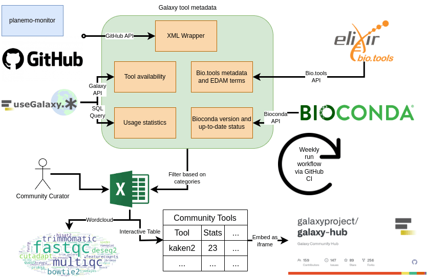
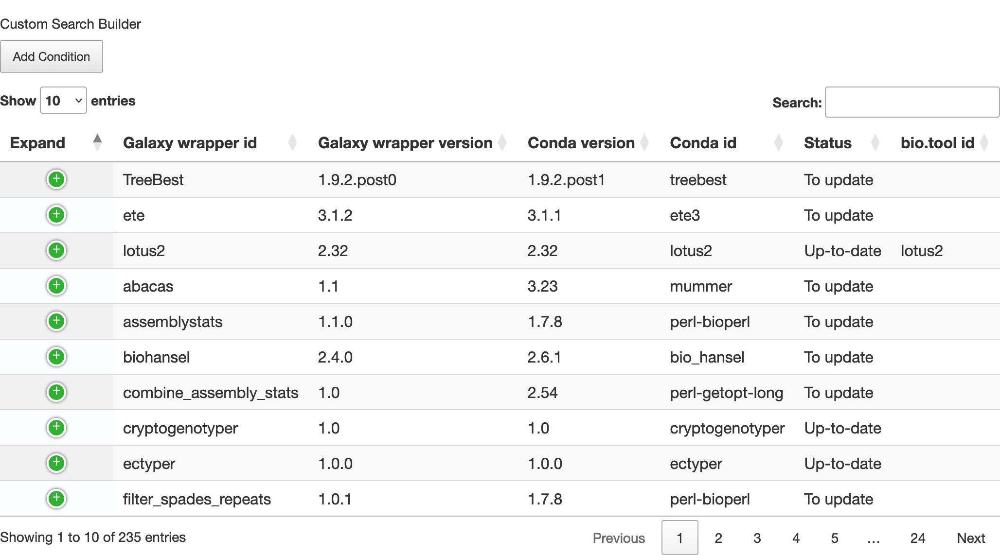
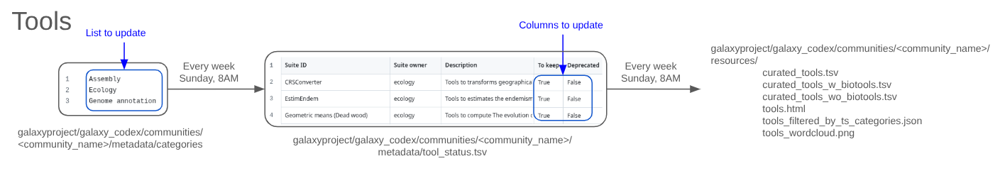

Galaxy offers thousands of tools. They are developed across various GitHub repositories. Furthermore, Galaxy also embraces granular implementation of software tools as sub-modules. In practice, this means that tool suites are separated into Galaxy tools, also known as wrappers, that capture their component operations. Some key examples of suites include [Mothur](https://bio.tools/mothur) and [OpenMS](https://bio.tools/openms), which translate to tens and even hundreds of Galaxy tools.

While granularity supports the composability of tools into rich domain-specific workflows, this decentralized development and sub-module architecture makes it **difficult for Galaxy users to find and reuse tools**. It may also result in Galaxy tool developers **duplicating efforts** by simultaneously wrapping the same software. This is further complicated by a lack of tool metadata, which prevents filtering for all tools in a specific research community or domain, and makes it all but impossible to employ advanced filtering with ontology terms and operations like [EDAM ontology](https://edamontology.org/page).

The final challenge is also an opportunity: the global nature of Galaxy means that it is a big community. Solving the visibility of tools across this ecosystem and the potential benefits are far-reaching for global collaboration on tool and workflow development.

To provide the research community with a comprehensive list of available Galaxy tools, [Galaxy Codex](https://github.com/galaxyproject/galaxy_codex) was developed to collect Galaxy wrappers from a list of Git repositories and automatically extract their metadata (including Conda version, [bio.tools](https://bio.tools/) identifiers, and EDAM annotations). The workflow also queries the availability of the tools and usage statistics from the three main Galaxy servers (usegalaxy.*).



The pipeline creates a [table with all tools and their metadata](https://galaxyproject.github.io/galaxy_codex/). This table can be **filtered to only include tools that are relevant to a specific research community**. Here is an example for the microbial related tools:

<iframe id="edam" src="https://galaxyproject.github.io/galaxy_codex/microgalaxy/" frameBorder="0" width="100%" height="600px">  </iframe>

The generated community-specific table can be used as is (e.g. downloadable tsv file) and/or embedded (e.g. into a Galaxy Hub page or Galaxy subdomain). This table allows further filtering and searching for fine-grained tool selection.

The pipeline is **fully automated** and executes on a **weekly** basis. Any research community can apply the pipeline to create a table specific to their community.

The aim is this tutorial is to create such table for a community.

> <agenda-title></agenda-title>
>
> In this tutorial, we will cover:
>
> 1. TOC
> {:toc}
>
{: .agenda}

# Add your community to the Galaxy CoDex

You first need to check if your Community is in the [Galaxy CoDex](https://github.com/galaxyproject/galaxy_codex/tree/main/communities), a central resource for Galaxy communities.
If the community is already there, you can move to the next step of this tutorial.

If you community is not already included, follow these steps :
> <hands-on-title>Add your community to the Galaxy CoDex</hands-on-title>
>
> You need to create a new folder in the data/community folder within Galaxy CoDex code source.
> 1. If not already done, fork the [Galaxy Codex repository](https://github.com/galaxyproject/galaxy_codex)
> 2. Go to the `communities` folder
> 3. Click on **Add file** in the drop-down menu at the top
> 4. Select **Create a new file**
> 5. Fill in the `Name of your file` field with:  name of your community + `/metadata/categories`
>    This will create a folder for your community, a new folder for your community called metadata and a file called categories.
> 6. Click on **Commit changes**
> 7. Fill in the commit message with something like `Add X community`
> 8. Click on `Create a new branch for this commit and start a pull request`
> 9. Create the pull request by following the instructions
>
{: .hands_on}

# Pull list of tools relevant to your community from the Galaxy ToolShed

To add tools in your community tool table, you will need to indicate a list of tags relevant to your community, and tools associated with this tag will be automatically pulled from the [Galaxy ToolShed](https://toolshed.g2.bx.psu.edu/) on a weekly basis. Only tools in the selected ToolShed categories will be added to the filtered table. As a result, it is recommended to include broad categories.
You will then be able to remove tools that are not relevant to your community or deprecated.

> <hands-on-title>Select the ToolShed categories</hands-on-title>
>
> 1. Go to the [Galaxy ToolShed](https://toolshed.g2.bx.psu.edu/)
> 2. On the main page, pick the most obvious categories that represent tools used by your community and note the names of these categories
> 3. Search on the [Galaxy ToolShed](https://toolshed.g2.bx.psu.edu/) for some of the popular tools in your community
> 4. Open the tool entries on the ToolShed, and note their categories
{: .hands_on}

# Add the list relevant tags for your community in the categories file

> <hands-on-title>Add the ToolShed catgories to the categories file</hands-on-title>
> 1. Open or create the file named `categories` in your comunity metadata folder (`communities/<your community>/metadata/categories`)
> 2. Add the name of the categories relevant to your community in the `categories` file you started above, with 1 ToolShed category per row. For example, see [a list of valid ToolShed categories](https://toolshed.g2.bx.psu.edu/).
>
>    For example:
>    ```
>    Assembly
>    Metagenomics
>    ```
{: .hands_on}

Once you have a list of the ToolShed categories that you wish to keep, you can submit this to Galaxy CoDex.

> <hands-on-title>Submit the new list of categories to Galaxy CoDex</hands-on-title>
>
> 1. Click on **Commit changes** at the top
> 2. Fill in the commit message with something like `Add tools categories for my community`
> 3. Click on `Create a new branch for this commit and start a pull request`
> 4. Create the pull request by following the instructions
>
{: .hands_on}

The Pull Request will be reviewed. Make sure to respond to any feedback.

On the Sunday following the merge of the previous pull request, two files will be generated :
- A JSON file with all tool suites and a short description will be created in `communities/<your community>/resources/tools_filtered_by_ts_categories.json`.
- A table with all tool suites and a short description will be created in `communities/<your community>/metadata/tool_status.tsv`.

# Review the generated table to curate tools

The generated table will contain all the tools associated with the ToolShed categories that you selected. However, not all of these tools might be interesting for your community.

Galaxy Codex allows for an additional optional filter for tools, that can be defined by the community curator (maybe that is you!).

The additional filter must be stored in the file called `tools_status.tsv` located in `communities/<your community>/metadata`. The file must include at least 3 columns (with a header):
1. `Suite ID`
2. `To keep` indicating whether the tool should be included in the final table (TRUE/FALSE).
3. `Deprecated` indicating whether the tool is deprecated (TRUE/FALSE).

Example of the `tools_status.tsv` file:
```
Suite ID	To keep	Deprecated
abacas	TRUE	FALSE
abricate	TRUE	FALSE
abritamr	TRUE	FALSE
```

To generate this file, we recommend you to use the generated file `tools_status.tsv` and to simply update the last two columns.

> <hands-on-title>Review tools in your community table</hands-on-title>
>
> 1. Download the `tools.tsv` file.
> 2. Open `tools.tsv` with a Spreadsheet Software.
> 3. Review each line corresponding to a tool.
>
>    You can also just review some tools. 
> 1. Add `TRUE` to the `To keep` column if the tool should be kept, and `FALSE` if not.
> 2. Add `TRUE` or `FALSE` also to the `Deprecated` column.
> 3. Export the new table as TSV.
> 4. Submit the TSV as `tools_status.tsv` in your community folder.
> 5. Wait for the Pull Request to be merged
>
{: .hands_on}

On the Sunday following the merge of the previous pull request, a `curated_tools.tsv` file will be generated in `communities/<your community>/resources/` folder reflecting the Galaxy tool landscape for your community. You or other community members can review tools in your community from this page to make step-by-step changes or updates to the `tools_status.tsv` file as needed.

We recommend collaborative work be done with a cloud-based system such as a Google Sheets page.

Here is an overview of the files (the top three files in the table are the most important):

| Filename | Location | Generation | Function | Format | Example (microgalaxy) |
| ------------- | ------------- | ------------- | ------------- | ------------- | ------------- |
| categories | communities/<your_community>/metadata/ | Manual | Name of the categories relevant to your community, with 1 ToolShed category per row | NA | [Example](https://github.com/galaxyproject/galaxy_codex/blob/main/communities/microgalaxy/metadata/categories) |
| tool_status.tsv | communities/<your community>/metadata/ | Automatic (to update manually) | Table with all tool suites and a short description | TSV | [Example](https://github.com/galaxyproject/galaxy_codex/blob/main/communities/microgalaxy/metadata/tool_status.tsv) |
| curated_tools.tsv | communities/<your_community>/metadata/ | Automatic | Curated table with all tool suites and a short description | TSV | [Example](https://github.com/galaxyproject/galaxy_codex/blob/main/communities/microgalaxy/resources/curated_tools.tsv) |
| curated_tools_w_biotools.tsv | communities/<your_community>/resources/ | Automatic | Curated table with all tool suites that have a biotools ID | TSV | [Example](https://github.com/galaxyproject/galaxy_codex/blob/main/communities/microgalaxy/resources/curated_tools_w_biotools.tsv) |
| curated_tools_wo_biotools.tsv | communities/<your_community>/resources/ | Automatic | Curated table with all tool suites without a biotools ID (You can add them on BioTools or link them!!) | TSV | [Example](https://github.com/galaxyproject/galaxy_codex/blob/main/communities/microgalaxy/resources/curated_tools_wo_biotools.tsv) |
| tools.html | communities/<your_community>/resources/ | Automatic | A list of the tools in html format to include in a website | HTML | [Example](https://github.com/galaxyproject/galaxy_codex/blob/main/communities/microgalaxy/resources/tools.html) |
| tools_wordcloud.png | communities/<your_community>/resources/ | Automatic | A wordcloud with the tools used the tool suites | PNG | [Example](https://github.com/galaxyproject/galaxy_codex/blob/main/communities/microgalaxy/resources/tools_wordcloud.png) |



# Embed the interactive table in your community page on the Hub

The interactive table you have created can be embedded in your community page on the Hub, e.g. [microGalaxy](https://galaxyproject.org/community/sig/microbial/#tools).

> <hands-on-title>Embed your table as an iframe</hands-on-title>
>
> 1.  If not already done, fork the repository [Galaxy Hub](https://github.com/galaxyproject/galaxy-hub)
> 2. Open or create your community page: `content/community/sig/<your community>/index.md`
> 3. Add an iframe to embed the interactive table
>
>    ```
>    <iframe
>      id="inlineFrameExample"
>      title="Microbial related tools"
>      width="100%"
>      height="600"
>      frameBorder="0"
>      src="https://galaxyproject.github.io/galaxy_codex/<your_community>/">
>    </iframe>
>    ```
>
> 4. Replace `<your_community>` by the name of your community in `src`
> 5. Submit the changes
> 7. Wait for the Pull Request to be merged
>
{: .hands_on}

# Conclusion

You now have curated resources listing Galaxy tools available for your community, and this table can be embedded in a community page.
