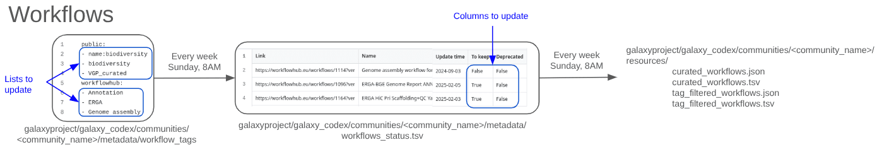

Similarly to the numerous tools available on Galaxy, numerous workflow are available on public Galaxy instances and in [Workflow Hub](https://workflowhub.eu/). This tutorail will take you through the steps to generate resources listing the relevant workflows and how to display them on your community codex page.

The pipeline creates a table with all the workflows associated to selected tags. This table can be **filtered to only include workflows that are relevant to a specific research community**.

The generated community-specific table can be used as it and/or embedded, e.g. into the respective Galaxy Hub page or Galaxy subdomain.

The pipeline is **fully automated** and executed on a **weekly** basis. Any research community can apply the pipeline to create a table specific to their community.

The aim of this tutorial is to create a workflow table for a community.

> <agenda-title></agenda-title>
>
> In this tutorial, we will cover:
>
> 1. TOC
> {:toc}
>
{: .agenda}

# Add your community to the Galaxy CoDex

You first need to check if your Community is in the [Galaxy CoDex](https://github.com/galaxyproject/galaxy_codex/tree/main/communities), a central resource for Galaxy communities.
If the community is already there, you can move to the next step of this tutorial.

If you community is not already included, follow this step :
> <hands-on-title>Add your community to the Galaxy CoDex</hands-on-title>
>
> You need to create a new folder in the data/community folder within Galaxy CoDex code source.
> 1. If not already done, fork the [Galaxy Codex repository](https://github.com/galaxyproject/galaxy_codex)
> 2. Go to the `communities` folder
> 3. Click on **Add file** in the drop-down menu at the top
> 4. Select **Create a new file**
> 5. Fill in the `Name of your file` field with:  name of your community + `/metadata/workflow_tags`
>    This will create a folder for your community, a new folder for your community called metadata and a file called workflow_tags.
> 6. Click on **Commit changes**
> 7. Fill in the commit message with something like `Add X community`
> 8. Click on `Create a new branch for this commit and start a pull request`
> 9. Create the pull request by following the instructions
>
{: .hands_on}

# Pull list of tags relevant to your community

To add workflows in your community workflow table, you will need to indicate a list of tags relevant to your community, and workflows associated with these tags will be automatically pulled from public Galaxy instances and [Workflow Hub](https://workflowhub.eu/). Only workflows with the selected tags will be added to the table.
You will then be able to remove workflows that are not relevant to your community or deprecated.

> <hands-on-title>Select workflows tags from the Galaxy instances</hands-on-title>
>
> 1. Go to your favorite public Galaxy instance.
> 2. Go to the `Workflow` section
> 3. Select `Public workflows` (for example: [Public workflows on the French instance](https://usegalaxy.fr/workflows/list_published))
> 4. Browse for workflows that are relevant to your community
> 5. Note the tags that are associated with workflows of interest
{: .hands_on}

> <hands-on-title>Select workflows tags from the Workflow Hub</hands-on-title>
>
> 1. Go to [Workflow Hub](https://workflowhub.eu/)
> 2. Browse for workflows that are relevant to your community
> 3. Note the tags that are associated with workflows of interest (in the `tag` section on the left of the workflow page)
{: .hands_on}

# Add the list relevant tags for your community in the workflow_tags file

> <hands-on-title>Add the relevant tags to the workflow_tags file</hands-on-title>
> 1. Open or create a file named `workflow_tags` in your comunity metadata folder (`communities/<your community>/metadata/workflow_tags`)
> 2. Add the name of the tags relevant to your community in the `workflow_tags` file you started above. The file is split in two sections : `Public`, which should inidcate the tags used on public Galaxy instances; and `workflowhub`, which indicates the tags to use to select workflow on [Workflow Hub](https://workflowhub.eu/).
>
>    For example:
>    ```
>    public:
>    - name:microgalaxy
>    - microgalaxy
>    workflowhub:
>    - abromics
>    - amr
>    - amplicon
>    ```
>
{: .hands_on}

Once you have a list of the tags that you wish to keep, you can submit this to Galaxy CoDex.

> <hands-on-title>Submit the new list of tags to Galaxy Codex</hands-on-title>
>
> 1. Click on **Commit changes** at the top
> 2. Fill in the commit message with something like `Add workflows tags for my community`
> 3. Click on `Create a new branch for this commit and start a pull request`
> 4. Create the pull request by following the instructions
>
{: .hands_on}

The Pull Request will be reviewed. Make sure to respond to any feedback.

On the sunday following merging of the pull request, a few files will be created :
- `communities/<your community>/metadata/workflow_status.tsv` : A table with all the workflows extracted with the tags mentionned above.
- `communities/<your community>/resources/curated_workflows.tsv` : A table with the same workflows as in the metadata file and additional information.
- `communities/<your community>/resources/curated_workflows.json` : A json file with the same info as the correponding table.
- `communities/<your community>/resources/tag_filtered_workflows.tsv` : At this stage, the same table as `curated_workflows.tsv`.
- `communities/<your community>/resources/tag_filtered_workflows.json` : At this stage, the same json as `curated_workflows.json`.


# Review the generated table to curate workflows

The generated table in the metadata folder (`communities/<your community>/metadata/workflow_status.tsv`) contains all the workflows associated with the tags that you selected. However, not all of these workflows might be interesting for your community.

Galaxy CoDex allows for an additional optional filter for workflows, that can be defined by the community curator (maybe that is you!).

To filter the workflows, you will update the values in the last two columns of the `communities/<your community>/metadata/workflow_status.tsv` file
- `To keep` indicating whether the tool should be included in the final table (TRUE/FALSE).
- `Deprecated` indicating whether the tool is deprecated (TRUE/FALSE).

You can modify the file directly in GitHub or download it to create a spreadsheet, easier to edit as a community.

> <hands-on-title>Modify workflows using spreadsheets</hands-on-title>
>
> 1. Download the `workflow_status.tsv` file in `communities/<your community>/metadata/`.
> 2. Open `workflow_status.tsv` with a Spreadsheet Software.
> 3. Review each line corresponding to a workflow.
>     1. Add `TRUE` to the `To keep` column if the tool should be kept, and `FALSE` if not.
>     2. Add `TRUE` or `FALSE` also to the `Deprecated` column.
> 5. Export the new table as TSV.
> 6. Submit the TSV as `workflow_status.tsv` in your `communities/<your community>/metadata/` folder.
> 7. Wait for the Pull Request to be merged
>
{: .hands_on}

On the sunday following merging of the pull request, the following files, reflecting the Galaxy tool landscape for your community, will be updated :
- `communities/<your community>/resources/curated_workflows.tsv`
- `communities/<your community>/resources/curated_workflows.json` 
- `communities/<your community>/resources/tag_filtered_workflows.tsv`
- `communities/<your community>/resources/tag_filtered_workflows.json`

You can step-by-step review all workflows in your community and update the `workflow_status.tsv` file. You could also share this file with your community members and discuss weather the workflow should be kept or not. Collaborative work could be established using google spreadsheet.


Here is an overview of the files (the top three files in the table are the most important):

| Filename | Location | Generation | Function | Format | Example (microgalaxy) |
| ------------- | ------------- | ------------- | ------------- | ------------- | ------------- |
| workflow_tags | communities/<your_community>/metadata/ | Manual | Name of the tags relevant to your community | NA | [Example](https://github.com/galaxyproject/galaxy_codex/blob/main/communities/microgalaxy/metadata/workflow_tags) |
| workflow_status.tsv | communities/<your community>/metadata/ | Automatic (To update manually) |  Table with all the workflows extracted with the tags mentioned above | TSV | [Example](https://github.com/galaxyproject/galaxy_codex/blob/main/communities/microgalaxy/metadata/tool_status.tsv) |
| curated_workflows.tsv | communities/<your_community>/resources/ | Automatic | Table containing only the curated workflows| TSV | [Example](https://github.com/galaxyproject/galaxy_codex/blob/main/communities/microgalaxy/resources/curated_workflows.tsv) |
| curated_workflows.json | communities/<your_community>/resources/ | Automatic | File containing only the curated workflows| JSON | [Example](https://github.com/galaxyproject/galaxy_codex/blob/main/communities/microgalaxy/resources/curated_workflows.json) |
| tag_filtered_workflows.tsv | communities/<your_community>/resources/ | Automatic | Table with all the workflows extracted with the tags mentioned above | TSV | [Example](https://github.com/galaxyproject/galaxy_codex/blob/main/communities/microgalaxy/resources/tag_filtered_workflows.tsv) |
| tag_filtered_workflows.json | communities/<your_community>/resources/ | Automatic | JSON file with all the workflows extracted with the tags mentioned above | JSON | [Example](https://github.com/galaxyproject/galaxy_codex/blob/main/communities/microgalaxy/resources/tag_filtered_workflows.json) |




# Embed the table in your community page on the Hub

The table you have created can be embedded in your community page on the Hub, e.g. [microGalaxy](https://galaxyproject.org/community/sig/microbial/#workflows-and-tutorials).

> <hands-on-title>Embed your table</hands-on-title>
>
> 1.  If not already done, fork the repository [Galaxy Hub](https://github.com/galaxyproject/galaxy-hub)
> 2. Open or create your community page: `content/community/sig/<your community>/index.md`
> 3. TO DO : We Will soon update this section to explain how to include the table, sorry for the inconvenience. 
> 4. Submit the changes
> 5. Wait for the Pull Request to be merged
>
{: .hands_on}

# Conclusion

You now have a table with workflows available for your community, and this table is embedded in a community page.
