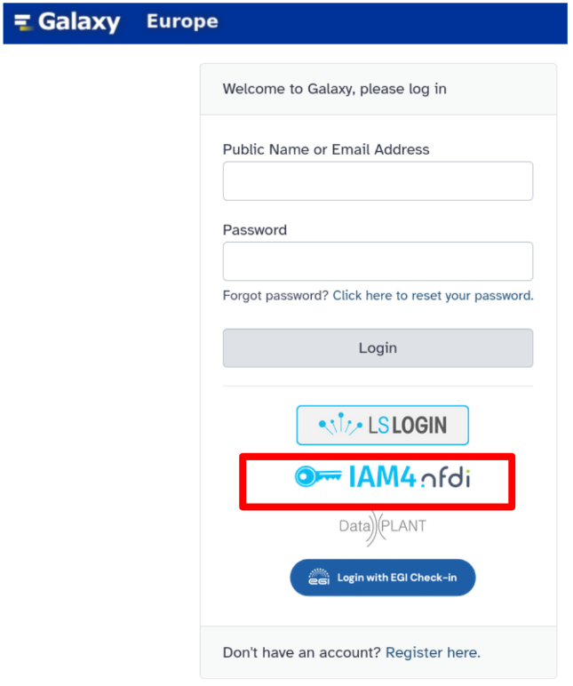
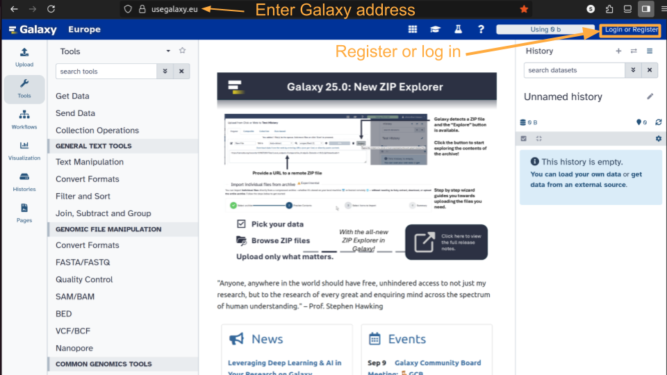
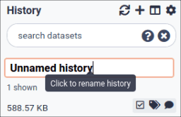
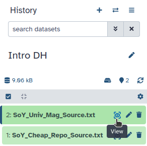
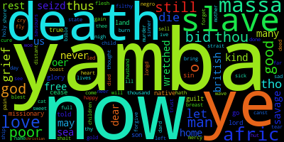
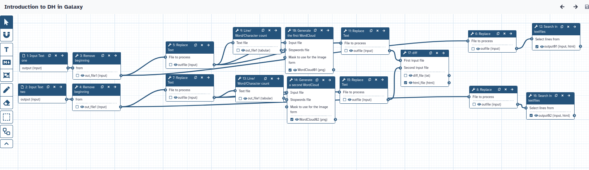

Loosely building on , this tutorial compares two editions of the poem "The Sorrows of Yamba".[^1]
The first couple of steps derive from [A short introduction to Galaxy]().

"The Sorrows of Yamba" was published in 1795 and was among the most popular antislavery poems. However, the version published by Hannah More in the Cheap Repository Tracts series was not the only version of the poem that circulated. Also, Moore's authorship on the topic is contested (). But while we leave this debate to the experts, the different versions of the poem offer a great opportunity to delve into how digital tools can help us compare texts more quickly. We will do this in the following tutorial.

While Richardson compared the poems by hand, we use his example to introduce how Galaxy can help you with your text analysis.
This tutorial covers the Galaxy basics, from logging in and uploading the texts to using the first tools.
We will clean the two poem versions and check the texts from a distance by comparing their number of lines and characters, and visualizing both in a word cloud.
Then, we take a closer look. For an easier comparison, we reformat both texts and compare them line by line and side by side. As the word cloud shows, "death" is a dominant theme in the first poem, so we extract all lines including "death" for further in-depth analysis. This helps us get a better idea of where those articles differ and is applicable to many other texts you might want to compare.

> <agenda-title></agenda-title>
>
> In this tutorial, we will cover:
>
> 1. TOC
> {:toc}
>
{: .agenda}

# Get started in Galaxy

## Create an account on Galaxy
To use Galaxy's full potential, you must register and create an account. You can skip this step if you already have a Galaxy account.



Alternatively, you can log in using a single sign-on of your choice, for example, from [IAM4NFDI](https://iam.services.base4nfdi.de/faq_ENG/) on [Galaxy Europe](https://usegalaxy.eu/).

 

## Log in to Galaxy

> <hands-on-title>Log in to Galaxy</hands-on-title>
> 1. Open your favourite browser (Chrome, Safari, Edge or Firefox as your browser, not Internet Explorer!)
> 2. Browse to your Galaxy instance, for example [Galaxy Europe](https://usegalaxy.eu/)
> 3. Log in with your credentials
>
> 
>
>   > <comment-title>Different Galaxy servers</comment-title>
>   >  This is an image of Galaxy Europe, located at [usegalaxy.eu](https://usegalaxy.eu)
>   >
>   > The particular Galaxy server you are using may look slightly different and have a different web address.
>   >
>   > You can also find more possible Galaxy servers at the top of this tutorial in **Available on these Galaxies**
>   {: .comment}
{: .hands_on}

The Galaxy homepage is divided into four sections (panels):
* The Activity Bar on the left: _This is where you will navigate to the resources in Galaxy (Tools , Workflows , Histories , etc.)_
* Currently active "Activity Panel" on the left: _By default, the  **Tools** activity will be active and its panel will be expanded_
* Viewing panel in the middle: _The main area for context for your analysis_
* History of analysis and files on the right: _Shows your "current" history; i.e.: Where any new files for your analysis will be stored_


The first time you use Galaxy, your history panel is empty.

## Name your current history

Your "History" is on the panel on the right. It is a record of the actions you have taken.

> <hands-on-title>Name history</hands-on-title>
> 1. Go to the **History** panel (on the right)
> 2. Click  (**Edit**) next to the history name (which by default is "Unnamed history")
>
>    {:width="250px"}
>
>    > <comment-title></comment-title>
>    >
>    > In some previous versions of Galaxy, you will need to click the history name to rename it as shown here:
>    > {:width="320px"}
>    {: .comment}
>
> 3. Type in a new name, for example, "My Analysis"
> 4. Click **Save**
>
> > <comment-title>Renaming not an option?</comment-title>
> > If renaming does not work, you may not be logged in, so try logging in to Galaxy first. Anonymous users can only have one history, and they cannot rename it.
> {: .comment}
>
{: .hands_on}

## Upload a file to Galaxy

The "Activity Bar" can be seen on the left-most part of the interface.

> <hands-on-title>Upload a file</hands-on-title>
> 1. At the top of the **Activity Bar**, click the  **Upload** activity
>
>    
>
>    This brings up a box:
>
>    
>
> 3. Click **Paste/Fetch data**
> 4. Paste in the address of both files in the Zenodo folder:
>    ```
>    https://zenodo.org/records/17053220/files/SoY_Cheap_Repo_Source.txt
>    https://zenodo.org/records/17053220/files/SoY_Univ_Mag_Source.txt
>    ```
>
> 5. Click **Start**
> 6. Click **Close**
>
>
> **Option 2:** On [usegalaxy.eu](https://usegalaxy.eu), you can alternatively import the Zenodo files directly from a *data library* within Galaxy:
>
> 1. At the top of the **Activity Bar**, click the  **Upload** activity
> 2. Click on the bottom of the newly opened window on **Choose from repository**.
> 3. Enter **"Zenodo"** in the search bar and click on the folder **"Zenodo"**.
> 4. Enter **Training material for Galaxy tutorial "Introduction to Digital Humanities in Galaxy"** in the search bar and select the items.
> 7. Click **Select**
> 8. Click **Start**
> 9. Click **Close**
{: .hands_on}


Your uploaded file is now in your current history.
When the file has been uploaded to Galaxy, it will turn green.

> <comment-title></comment-title>
> After this, you will see your first history item (called a "dataset") in Galaxy's right panel. It will go through
> the grey (preparing/queued) and yellow (running) states to become green (success).
>
{: .comment}

The contents of the file will be displayed in the central Galaxy panel. If the dataset is large, you will see a warning message which explains that only the first megabyte is shown.

> <hands-on-title>View the text files content</hands-on-title>
> 1. Click the  (eye) icon next to the dataset name, to look at the file content
>
>    {:width="520px"}
>
> 2. Check the datatype - is it **txt**? Then you are all set. Otherwise, adapt the datatype.
>
>    
>
> 3. **Add a tag** to each database a corresponding to the file's origin.
>    - One saying `#cheap` for the file from the cheap repository (SoY_Cheap_Repo_Source.txt)
>    - The other one `#universal` for the second one (SoY_Univ_Mag_Source.txt)
>    - Don't forget the hashtags
>
>    
>
{: .hands_on}


What are those files?

You can see two text files; they are two versions of the poem "The Sorrows of Yamba".
The file "SoY_Cheap_Repo_Source.txt" is a poem version of Sorrows of Yamba, which was published in the [Cheap Repository](https://archive.org/details/McGillLibrary-PN970_C52_no_42a-1732).
The file "SoY_Univ_Mag_Source.txt" is another version of the poem, first published in the Universal Magazine in 1797.

Both files start with "Text adapted from:" and a different hyperlink. The second paragraph for both texts begins with "the sorrows of yamba," but the files continue differently. While one gives the year, the other is immediately followed by more text.
Both texts are already pre-cleaned and are entirely in lower case, but still contain punctuation.

It is obvious that the texts have similarities, but they are not identical. Now comes the fun part: Using Galaxy to compare your files. To do that, we first need to clean both files.

# Clean your Texts

## Delete the hyperlink


When looking at the two datasets, you will notice they still contain the hyperlink from their source.
As this is metadata and not the text we want to compare, we delete it at the beginning of both files.


> <hands-on-title> Delete Hyperlink in Text One </hands-on-title>
>
> 1. Click on **Tools**  in the left panel
> 2. Search for  and pass the following parameters:
>    - *"Remove first"*: `1` (lines)
>    -  *"from"*: `1: SoY_Cheap_Repo_Source.txt`
> 3. Click on **Run Tool** 
>
>    > <comment-title> What does this tool do? </comment-title>
>    >
>    > Remove beginning deletes a selected number of lines from your file. In this case, removing the first line is enough.
>    {: .comment}
>
{: .hands_on}

When the job is finished and appears green in your history, click on its name.

> <question-title></question-title>
>
> 1. Check how many lines the file now contains?
> 2. How does this differ from the original file you uploaded?
>
> > <solution-title></solution-title>
> >
> > 1. The file now contains only one line.
> > 2. The originally uploaded text contained two lines. You removed one with this step.
> >
> {: .solution}
>
{: .question}

As a result, only the poem's text remains, while the source was removed for text one.
Galaxy names the files after the task used to create that step. While this can be helpful, we change the name to a clearer filename.

> <hands-on-title> Rename the output</hands-on-title>
>
> 1. **Change the name**  of the output of this tool, which removed the beginning of `SoY_Cheap_Repo_Source.txt`
>    - Rename it to `SoY_Cheap_Repo.txt`
>
>    
>
{: .hands_on}


We also use this tool on the second file.


> <hands-on-title> Delete Hyperlink in Text Two </hands-on-title>
>
> 1. Run   with the following parameters:
>    -  *"from"*: `2: SoY_Univ_Mag_Source.txt`
>
>    
> 
> 2. Once it is finished, rename this file to `SoY_Univ_Mag.txt`.
>
{: .hands_on}


Click on the finished dataset that just appeared in your history. Check that it starts with the poem text and that the hyperlink is removed.
To quickly see which version of the poems we have, we rename both datasets with clearer names and add tags based on the text origin.
The hashtag propagates the tags, so all further outputs from this dataset contain the same hashtag, making it much easier to identify what text we are currently working with.


Depending on how detailed you want to compare your texts, we suggest further unifying them. In the next step, we remove all the punctuation with one command.


## Remove punctuation

Regular Expressions (RegEx) allow you to search for particular patterns in your text. They can be a massive help if you want to extract or remove them with minimal work. In our two poems, the punctuation is not unified, and therefore, we want to remove it from both using RegEx. If comparing the punctuation of texts is also relevant to you, you can skip this step. Make sure to select the text version from the Cheap Repository that we have earlier removed the hyperlink from.

> <hands-on-title> Remove Punctuation in Poem One </hands-on-title>
>
> 1. Run   with the following parameters:
>    -  *"File to process"*: `SoY_Cheap_Repo.txt`
>    - In *"Replacement"*:
>        -  *"Insert Replacement"*
>            - *"Find pattern"*: `[[:punct:]]`
>            - *"Replace with"*: (leave this empty)
>
>    
>
> 2. Rename your output file (once it is green) to `SoY_Cheap_Repo_cleaned.txt`
>
>    
>
{: .hands_on}


And we repeat the same for the second text. Remember to use the redo button if you want to save some time.

Also in text two, we search for the pattern `[[:punct:]]` and omit a replacement, meaning that all punctuation marks will be deleted. Make sure to select the text version from the Universal Magazine that we earlier removed the hyperlink from.

> <hands-on-title> Remove Punctuation in Poem Two </hands-on-title>
>
> 1. Run   with the following parameters:
>    -  *"File to process"*: `SoY_Univ_Mag.txt`
>    - In *"Replacement"*:
>        -  *"Insert Replacement"*
>            - *"Find pattern"*: `[[:punct:]]`
>            - *"Replace with"*: (leave this empty)
>
> 2. **Rename**  the output file to `SoY_Univ_Mag_cleaned.txt`
>
>
{: .hands_on}

To get an idea of how the two cleaned texts compare, we check out their metadata.

# Different ways to compare the texts

## Compare quantitatively

The tool  allows us to get a quick overview of a text. We want to see if the cleaned versions are different from each other.

> <hands-on-title> Count the Characters of Poem One </hands-on-title>
>
> 1. Run   with the following parameters:
>    -  *"Text file"*: `SoY_Cheap_Repo_cleaned.txt`
>
> 2. **Rename**  the output of this step to `Line/Word/Character count Cheap Repo`.
>
{: .hands_on}


Once the dataset has finished running and appears green, click on the eye  symbol. You can see how many lines, words and characters the text consists of.
And again, we run  the tool on the second poem.

> <hands-on-title> Count the Characters of Poem Two </hands-on-title>
>
> 1. Run   with the following parameters:
>    -  *"Text file"*: `SoY_Univ_Mag_cleaned.txt`
>
> 2. **Rename**  this output to `Line/Word/Character count Universal` for easier distinction.
>
{: .hands_on}


> <question-title>How do the texts compare</question-title>
>
> 1. How many lines do the poems have?
> 2. Which of the two texts contains more words, and how many?
>
> > <solution-title></solution-title>
> >
> > 1. Both texts consist of only two lines.
> > 2. The poem version from the cheap repository is longer, containing 1139 words, more than double the amount of the second poem.
> >
> {: .solution}
>
{: .question}

The differences between the two texts are quantifiable, but do these also affect the content?

## Compare visually

A picture says more than 1000 words! Accordingly, we want to get closer to the actual content of both texts. Particularly for larger corpora, a word cloud can be a nice way to get a first idea of what a text is about. Make sure not to use the latest outputs this time, as they contain only metadata and not the texts we want to compare. Select the cleaned poem versions for a more meaningful word cloud output.

> <hands-on-title> Visualize the Content of Poem One </hands-on-title>
>
> 1. Run   with the following parameters:
>    -  *"Input file"*: `SoY_Cheap_Repo_cleaned.txt` (output of **Replace Text** )
>    - *"Do you want to select a special font?"*: `Use the default DroidSansMono font`
>    - *"Color option"*: `Color`
>    - *"Scaling of words by frequency (0 - 1)"*: `0.8`
>
>    > <comment-title> Adapting the Word Cloud </comment-title>
>    >
>    > The word cloud has many different features. You can upload a stop word list that should be excluded from the visualization, or play around with other parameters like the text size. Rerun  the tool with some changed parameters and see what happens.
>    {: .comment}
>
{: .hands_on}

We also rerun  the word cloud with the second poem.

The word cloud for the second text is created in the same way. We suggest rerunning the tool with the second text, but with the same parameters you used for creating the first word cloud image, for better comparability. That makes both comparable.

> <hands-on-title> Visualize the Content of Poem Two </hands-on-title>
>
> 1. Run   with the following parameters:
>    -  *"Input file"*: `SoY_Univ_Mag_cleaned.txt` (output of **Replace Text** )
>    - *"Do you want to select a special font?"*: `Use the default DroidSansMono font`
>    - *"Color option"*: `Color`
>    - *"Scaling of words by frequency (0 - 1)"*: `0.8`
>
>    > <comment-title> Uniqueness of the Word Cloud </comment-title>
>    >
>    > The word cloud from this tool looks a little different each time you run it. The layout may vary even when you are redoing it with the exact same texts and inputs.
>    {: .comment}
>
{: .hands_on}

Comparing items from your history is easiest when enabling the window manager and seeing both images side by side.




> <question-title></question-title>
>
> 1. What is the most prominent word in each of the clouds?
> 2. How do the Word Clouds for Poem One and Poem Two compare?
>
> > <solution-title></solution-title>
> >
> > 1. The most prominent word in the word cloud created from the cheap repository is "yamba", while the one from the universal text is "death".
> > 2. The word cloud from the cheap repository has four words that appear most prominent and are much bigger - and therefore more frequent in the text. They are "yamba", "now", "death" and "ye". The most prominent words in the universal text are "death", "yamba" and "africs". They appear a bit smaller than the words from the cheap repository, suggesting a lower frequency.
> >
> > 
> > 
> {: .solution}
>
{: .question}

You can disable the window manager again by clicking on the item, then you will see your datasets again in your middle panel, once you click on its eye  symbol.

The visualisation suggests that the text's metrics, which we checked with the line and character count, and their messages differ. The cheap repository text addresses the reader with multiple mentions of "ye", you, which is rare in the second poem. In the universal poem, death is more central than yamba, which is the other way around in the cheap repository text.

With this text's length and just two poems, this is, of course, something you can find out by reading both texts. However, this distant reading approach can give you important preliminary insights to guide your close reading, particularly with bigger corpora.

Of course, the word cloud insights are just a first glance and do not allow a proper analysis; we need to compare both texts properly. But what is a good way to do this? We suggest comparing them side by side and line by line. For that, we adapt the layout once more.


## Replace spaces with line breaks to prepare side-by-side comparison

We used the tool to replace text before. We are not deleting something this time, as we did with the punctuation, but we are replacing some characters. To get a convenient layout that shows one word per line, we replace the spaces (\s) with line breaks (\n). That way, each word gets displayed in a different line, which prepares the detailed comparison in the next step.

Regular Expressions help again by changing all spaces with line breaks with just one command.


> <hands-on-title> Changing Layout of Poem One </hands-on-title>
>
> 1. Run   with the following parameters:
>    -  *"File to process"*: `SoY_Cheap_Repo_cleaned.txt`
>    - In *"Replacement"*:
>        -  *"Insert Replacement"*
>            - *"Find pattern"*: `\s`
>            - *"Replace with:"*: `\n`
>
>
>    > <comment-title> How do I understand the RegEx commands? </comment-title>
>    >
>    > Don't worry, if you have never used regular expressions. Several websites help you find out what patterns to detect and how to catch the passages you need. For now, you can just add the symbols that stand for the space (\s) and the line break (\n).
>    {: .comment}
>
> 2. **Rename**  this text `SoY_Cheap_Repo_word_per_line.txt`.
>
{: .hands_on}


When you click on the eye  icon of the data set in the history now, when the dataset turns green, you can see that it now contains one word per line. To match this, we repeat the step with the same parameters also for the second poem.


> <hands-on-title> Changing Layout of Poem Two </hands-on-title>
>
> 1. Run   with the following parameters:
>    -  *"File to process"*: `SoY_Univ_Mag_cleaned.txt`
>    - In *"Replacement"*:
>        -  *"Insert Replacement"*
>            - *"Find pattern"*: `\s`
>            - *"Replace with:"*: `\n`
>
> 2. **Rename**  this text `SoY_Univ_Mag_word_per_line.txt`.
>
{: .hands_on}


> <question-title></question-title>
>
> 1. How many lines long are the poems now?
>
> > <solution-title>  </solution-title>
> >
> > 1. When you click on the two names of the two new datasets you just worked on, you see that one is now 539, the other 1139 lines long. The number of lines now matches the word number we detected with the tool `Line/Word/Character count`.
> >
> {: .solution}
>
{: .question}

Now, both poems show one word per line, which is the perfect setup to compare them side by side. Use a tool called `diff` to visualise this. To get the same order as the tutorial, make sure to select the version from the Cheap Repository as the first input file and the one from the Universal Magazine as the second input file.

## Compare side-by-side with *diff*

> <hands-on-title> Compare the Poems </hands-on-title>
>
> 1. Run   with the following parameters:
>    -  *"First input file"*: `SoY_Cheap_Repo_word_per_line.txt`
>    -  *"Second input file"*: `SoY_Univ_Mag_word_per_line.txt`
>    - *"Choose a report format"*: `Generates an HTML report to visualize the differences`
>    - *"Choose report output format"*: `Side by side`
>
>    > <comment-title> Different Report Formats </comment-title>
>    >
>    > The `diff` tool allows you to create different outputs, depending on your goal. In this case, the HTML report contains colours to highlight the changes between both texts, making it really useful for researchers to quickly identify. If you want to extract information automatically, the option `text file, side by side` could also be helpful.
>    {: .comment}
>
{: .hands_on}

We get two new files as a result. The HTML report and the raw output it is based on, in txt format.

> <question-title></question-title>
>
> 1. What is the first difference between the two texts visualized in the HTML report?
>
> > <solution-title></solution-title>
> >
> > 1. Lines 6-40 of the cheap poem are marked in green. They are not part of the universal poem. The couple of lines before and after are identical.
> >
> {: .solution}
>
{: .question}

In the HTML report, you can quickly identify deletions (in red) and additions (in green) between both texts.
You can also see smaller details, which you might quickly miss manually. Lines 63/64 and 28/29, respectively, show that also changes within one word (prisoner / prisner) are detected. You can furthermore see how the perspective was changed between the poems. While line 359-361 in the cheap repository text states "they sell us", the other text states "they sell them" (l. 298-300), suggesting the reader is (no longer) among the group which is sold. You can go through it and detect further changes in language and length.

Seeing this, you might want to go into detail with the respective themes once more. As "death" was central in both texts, we will extract sentences containing this word so you can analyze them more closely. The cleaned texts without punctuation and one word per line are not the easiest form for this. Instead, we use an earlier version from our history.

# Extract specific sentences

## Breaking text into sentences

We return to Regular Expressions a third time, but this time we use a different tool with further functionalities. We use it to divide the text into more lines, to make it easier to extract those containing the word "death." Here, punctuation is a helpful stop point. We use full stops to indicate a sentence, which will not be perfectly accurate but sufficient for this case. We then add a line break after the full stops to get complete sentences. Of course, you could spend more time on this and make it neater. Make sure to use not the last input but the poems without a hyperlink, but including punctuation. It will not work if the text contains no more full stops.

> <hands-on-title> Rearrange Poem One </hands-on-title>
>
> 1. Run   with the following parameters:
>    -  *"File to process"*: `SoY_Cheap_Repo.txt`
>    - In *"Find and Replace"*:
>        -  *"Insert Find and Replace"*
>            - *"Find pattern"*: `\.`
>            - *"Replace with"*: `\.\n`
>            - *"Find-Pattern is a regular expression"*: `Yes`
>            - *"Replace all occurences of the pattern"*: `Yes`
>            - *"Find and Replace text in"*: `entire line`
>
>    > <comment-title> What do those inputs mean? </comment-title>
>    >
>    > A full stop (.) has its own meaning in regular expressions. It stands for all elements. To show that we do not mean all characters but actually a full stop, we need to escape it in RegEx by putting `\.` instead of `.` if we mean a full stop. We want to add a line break afterwards, which we already learned is indicated as `\n`. The replacement pattern, therefore, is `\.\n`.
>    {: .comment}
>
> 2. **Rename**  your resulting file to `SoY_Cheap_Repo_sent_per_line.txt`.
>
{: .hands_on}


Remember to redo this step for the second poem when you have finished this step.

> <hands-on-title> Rearrange Poem Two </hands-on-title>
>
> 1. Run   with the following parameters:
>    -  *"File to process"*: `SoY_Univ_Mag.txt`
>    - In *"Find and Replace"*:
>        -  *"Insert Find and Replace"*
>            - *"Find pattern"*: `\.`
>            - *"Replace with"*: `\.\n`
>            - *"Find-Pattern is a regular expression"*: `Yes`
>            - *"Replace all occurences of the pattern"*: `Yes`
>            - *"Find and Replace text in"*: `entire line`
>
> 2. **Rename**  your resulting file to `SoY_Univ_Mag_sent_per_line.txt` for easier distinction.
>
{: .hands_on}

As a result, you get two files, each split at full stops. How can you now extract the sentences that are relevant to you?


## Extract sentences containing 'death'

Use  to select all lines containing the word "death".

> <hands-on-title> Extract particular sentences </hands-on-title>
>
> 1. Run   with the following parameters:
>    -  *"Select lines from"*: `SoY_Cheap_Repo_sent_per_line.txt`
>    - *"Regular Expression"*: `death`
>
>    > <comment-title> Further Functionalities </comment-title>
>    >
>    > You can see that the tool has many parameters you can tweak.  The ones not mentioned here are kept at the default input, like `Match` and `Perl,` which is the kind of RegEx applied. But you could also select all lines that do not contain death by selecting `Do not match` or extracting lines before or after the line containing the content you chose.
>    {: .comment}
>
> 2. **Rename**  your output `SoY_Cheap_Repo_death.txt`
>
{: .hands_on}


And for the last time, we redo this step for the second poem.

> <hands-on-title> Extract particular sentences from Poem Two </hands-on-title>
>
> 1. Run   with the following parameters:
>    -  *"Select lines from"*: `SoY_Univ_Mag_sent_per_line.txt`
>    - *"Regular Expression"*: `death`
>
> 2. **Rename**  your output `SoY_Univ_Mag_death.txt`.
>
{: .hands_on}


When you enable the window manager at the top bar, you can click on the eye  symbols of your last two outputs and visualize them side by side in two different windows. Six and seven lines from the poem contain the term, respectively. You could analyze them in detail now to see where they differ. While the first lines are nearly identical, the last ones are completely different in both versions of the poem. An intriguing insight for further analysis. No wonder the poems and their many editions have sparked the interest of many researchers.

If you only analyze those two poems, you might find it easier to do those steps manually. But particularly, if you create a workflow out of this, you can reproduce this process with only a few clicks, saving you considerable work.

Learn how to [extract a workflow from the above analysis]().

Alternatively, you can make your analysis more complex and extract further differences between the poems automatically to adapt the above analysis. For inspiration, check out
the [advanced tutorial on Text-Mining]().

# Conclusion

Congratulations! You just finished your first analysis with Galaxy, well done! The tutorial covered the basic setup of Galaxy and how you can register, log in and upload your material. You are now familiar with terms in Galaxy, like history, dataset, tool, etc. We used several tools, learned to rerun them and how we can see the outputs in different ways. We used various versions of Regular Expressions to rearrange and clean your text. We also reshaped the text to compare it with the `diff` tool. In the end, we extracted notable sentences for further close reading.
The workflow created from this history would look as follows:

 

With all this knowledge in mind, you can now continue with one of our other tutorials or experiment with your own input. Enjoy!


[^1]: Thanks to Lilli Fortmeier for suggesting this use case!
