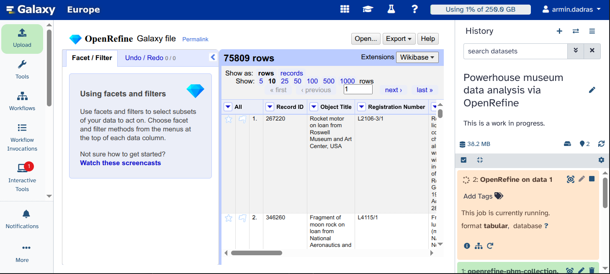
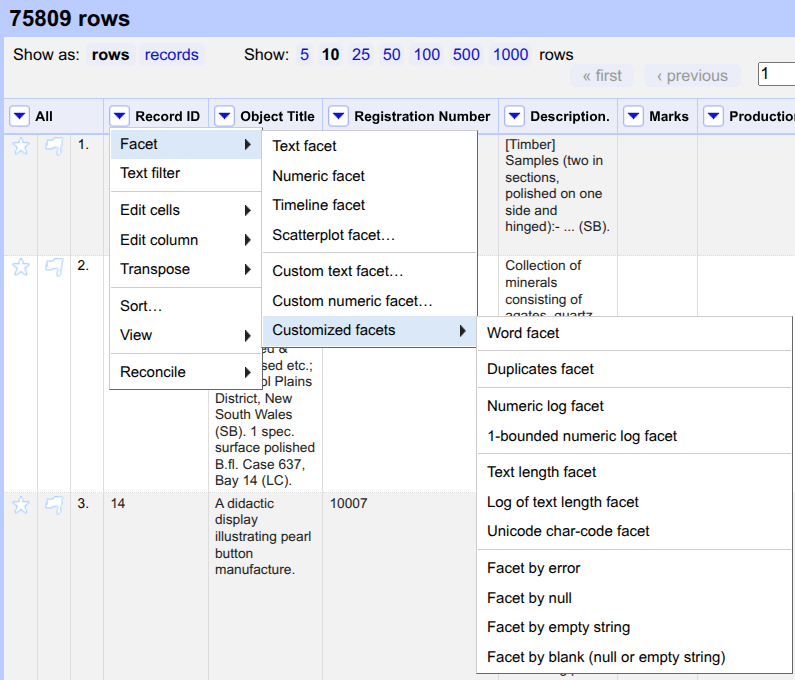
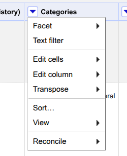
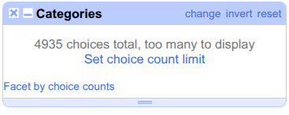
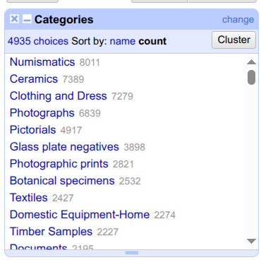
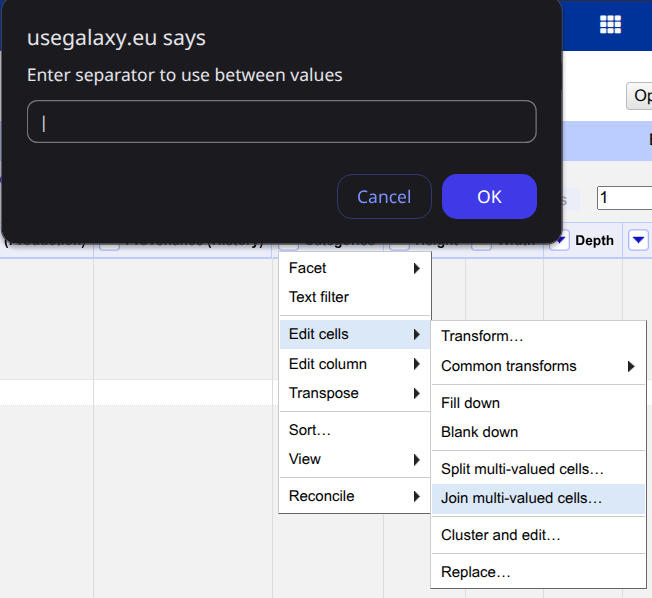
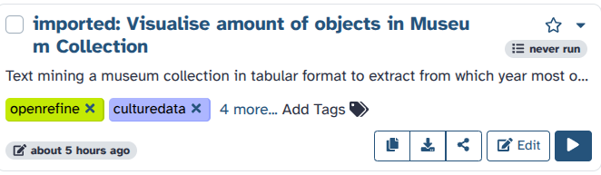
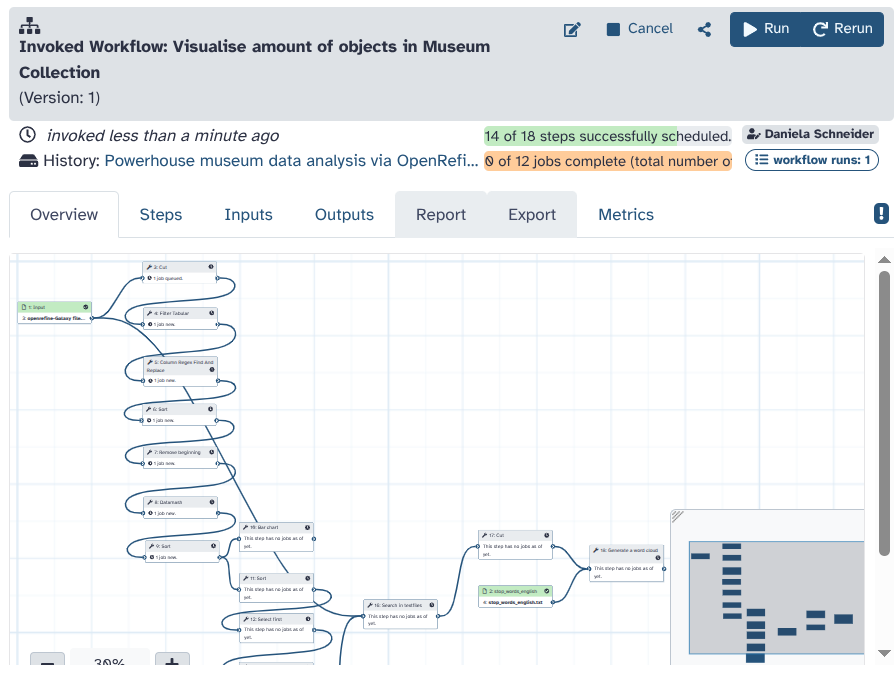

This tutorial shows how to use **OpenRefine** in Galaxy to clean and visualise data from the **humanities and social sciences**. This tutorial has two parts: an introduction to OpenRefine based on  adapted for Galaxy, and an introduction to running a **Galaxy workflow** to visualise the cleaned data and extract particular information.

**OpenRefine** is a free, open-source “data wrangler” built for messy, heterogeneous, evolving datasets. It imports common formats (CSV/TSV, Excel, JSON, XML) and domain-specific ones used across GLAM (Galleries, Libraries, Archives and Museums) and official statistics (MARC, RDF serializations, PC-Axis). It is **non-destructive**—OpenRefine copies rather than alters your source files, saves projects locally, and by default runs only on **localhost**. Facets and filters let you audit categories, surface outliers, and triage inconsistencies without code. Its **clustering** tools consolidate near-duplicates using both key-collision methods (fingerprint, n-gram, phonetic) and edit-distance/nearest-neighbour methods (Levenshtein, PPM) so you can standardize names and places at scale while keeping human oversight. For enrichment, OpenRefine speaks the **Reconciliation API** to match local values to external authorities (e.g. **Wikidata**, **ROR**) and optionally pull back richer metadata. Transformations—both point-and-click and **GREL** formulas—are recorded as a stepwise, undoable history that you can export as JSON and re-apply to other datasets, enabling reproducible cleaning and easy peer review. Finished tables export cleanly to **CSV/TSV**, ODS/XLS(X), SQL statements, templated JSON, Google Sheets, or **QuickStatements** for Wikidata.

**Galaxy workflows.** Galaxy Workflows are structured, stepwise pipelines you build and run entirely in the browser—either extracted from a recorded analysis *history* or assembled in the visual editor. They can be annotated, shared, published, imported, and rerun, making them ideal for teaching, collaboration, and reproducible research. A captured analysis is easy to share: export the workflow as JSON (**`.ga`**: tools, parameters, and Input/Output) or export a provenance-rich run as a **[Workflow Run RO-Crate](https://www.researchobject.org/workflow-run-crate/)** bundling the definition with inputs, outputs, and invocation metadata. This lowers the barrier to entry (no local installs; web UI with pre-installed tools and substantial compute) while preserving best practices (histories track tool versions and parameters; workflows are easily re-applied to new data). For findability and credit, the community uses **[WorkflowHub](https://workflowhub.eu/)**—a curated registry that supports multiple workflow technologies (including Galaxy) and promotes **FAIR** principles; it offers Spaces/Teams, permissions, versioning, and **DOIs via DataCite**, with metadata linking to identifiers like **[ORCID](https://orcid.org/)** so contributions enter scholarly knowledge graphs and are properly acknowledged. In practice, you can iterate on a workflow in a familiar GUI, export the exact definition or a run package, and deposit it where peers can discover, reuse, review, and cite it—closing the loop between simple authoring and robust scholarly dissemination.

> <agenda-title></agenda-title>
>
> In this tutorial, we will cover:
>
> 1. TOC
> {:toc}
>
{: .agenda}

# Get the data

We will work with a slightly adapted dataset from the **[Powerhouse Museum](https://powerhouse.com.au/)** (Australia’s largest museum group) containing collection metadata. The museum shared the dataset online before giving API access to its collection. We slightly adapted the dataset and put it on Zenodo for long-term reusability. The tabular file (**36.4 MB**) includes **14 columns** for **75,811** objects, released under a **[Creative Commons Attribution Share Alike (CCASA) license](http://creativecommons.org/licenses/by-nc/2.5/au/)**. We will answer two questions: *From what year does the museum have the most objects?* and *what objects does the museum have from that year?*

**Why this dataset.** It is credible, openly published, and realistically messy—ideal for practising problems scholars encounter at scale. The *Programming Historian* lesson works from an archived TSV export (*phm-collection.tsv*) released under a **[Creative Commons Attribution–ShareAlike licence](http://creativecommons.org/licenses/by-nc/2.5/au/)**, ensuring reproducibility even as the live collection evolves. Records include persistent links back to object pages and a **Categories** field populated from the **Powerhouse Museum Object Names Thesaurus (PONT)**, a controlled vocabulary reflecting Australian usage. The tutorial deliberately surfaces common quality issues—blank values that are actually stray whitespace, duplicate rows, and multi-valued cells separated by the pipe character `|` (including edge cases where **double pipes** `||` inflate row counts)—so we can practice systematic inspection before any analysis. During cleaning you will compute sanity checks (after de-duplication the dataset drops to **XXXX** unique records; a facet reveals **XXXX** distinct categories and **XXXX** items with no category). Without careful atomization and clustering, these irregularities would bias statistics, visualizations, and downstream reconciliation.
We suggest to you to download the data from the Zenodo record as explained below. This help us with the reproducibility of the resutls.

> <hands-on-title>Upload your data</hands-on-title>
>
> 1. Create a new history for this tutorial and name it "Powerhouse Museum — OpenRefine"
> 2. Import the AnnData file from [Zenodo]({{page.zenodo_link}}):
>
>    ```
>    {{ page.zenodo_link }}/files/ncm_pdcs_subset.h5ad #example needs to be replaced
>    ```
>
>    
>
>    
>
> 3. Rename the dataset: "**Powerhouse Museum metadata**."
> 4. Ensure that the datatype is correct. Otherwise, use convert datatype.
>
>    
>
{: .hands_on}

# Use OpenRefine to explore and clean your dataset

Here maybe we should briefly explain what the user will be doing. 

> <hands-on-title>Opening the dataset with OpenRefine</hands-on-title>
>
> 1. Open the : Working with messy data  
>    - *"Input file in tabular format"*:  `openrefine-phm-collection.tsv`  
>
> 2. Click on "Run Tool".  
>
>    <p align="center">
>      
>    </p>
>
> 3. After around 30 seconds, using the interactive tools section on the left panel, you can open OpenRefine by clicking on its name.  
>
>    <p align="center">
>      
>    </p>
>
> 4. Here, you can see the OpenRefine GUI. Click on `Open Project`.  
>
>    <p align="center">
>      
>    </p>
>
> 5. Click on `Galaxy file`.  
>
>    <p align="center">
>      
>    </p>
>
> 6. You can see the data loaded for you.  
>
>    <p align="center">
>      
>    </p>
>
{: .hands_on}

> <question-title></question-title>
>
> 1. How many rows does this table have?
>
> > <solution-title></solution-title>
> >
> > 1. 75809
> >
> {: .solution}
{: .question}

> <hands-on-title>Removing the blank rows</hands-on-title>
>
> 1. Click on the triangle on the left of `Record ID`.  
>
>    <p align="center">
>      
>    </p>
>
> 2. Click on `Sort...`.  
>
> 3. Select `numbers` and click on `OK`.  
>
>    <p align="center">
>      
>    </p>
>
> 4. Above the table, click on `Sort` and select `Reorder rows permanently`.  
>
>    <p align="center">
>      
>    </p>
>
> 5. Click on the triangle left of the `Record ID` column. Hover over `Edit cells` and select `Blank down`.  
>
>    <p align="center">
>      
>    </p>
>
> 6. Click on the triangle left of the `Record ID` column. Hover over `Facet`, then move your mouse to `Customized facets` and select `Facet by blank (null or empty string)`.  
>
>    <p align="center">
>      
>    </p>
>
> 7. On the left, a new option appears under `Facet/Filter` with title `Record ID`. Click on `true`.  
>
>    <p align="center">
>      
>    </p>
>
> 8. Click on the triangle left to the column called `All`. Hover over `Edit rows`, and select `remove matching rows`.  
>
>    <p align="center">
>      
>    </p>
>
> 9. Close the `Facet` by clicking on the cross (x) to see all rows.  
>
{: .hands_on}

> <question-title></question-title>
>
> 1. How many rows have been removed?
>
> > <solution-title></solution-title>
> >
> > 1. 84
> >
> {: .solution}
{: .question}

> <hands-on-title>Find and replace typos using GREL</hands-on-title>
>
> To remove the occurance of double pipe \|\| from the file we can do the following:
> 1. Click on the triangle on the left of `Categories` and select `Text filter`.
> 2. On the left, using the `Facet/Filter` section, search for the occurance of \| and \|\|. There are 71061 rows with \| and 9 rows with \|\|. We want to remove these 9 lines as they are there by mistake.
> 3. Click on the triangle on the left of `Categories` and hover over `edit cells` and click on `Transform...`.
> 4. In the new window, use the following text `value.replace('||', '|')` as "Expression" and click on `OK`.
> 
> We can also remove the double occurance of the same for different entries as follows:
> 1. Click on the triangle on the left of `Categories` and hover over `edit cells` and click on `Transform...`.
> 2. In the new window, use the following text `split('|').uniques().join('|')` as "Expression" and click on `OK`.value.




> <question-title></question-title>
>
> 1. How many cells had duplicated categories?
>
> > <solution-title></solution-title>
> >
> > 1. 1,668
> >
> {: .solution}
{: .question}

Mybe here we explain a bit -Perhaps what atomization is or so... and why is the enxt step. 


> <hands-on-title>Atomization</hands-on-title>
>
> Once the duplicate records have been removed, we can have a closer look at the Categories column. Different categories are separated from each other by pipe (\|). Each entry can have more than one category. In order to analyze in detail the use of the keywords, the values of the Categories column need to be split up into individual cells on the basis of the pipe character.
> 1. Click on the triangle on the left of `Categories` and hover over `edit cells` and click on `Split multi-valued cells...`.
> 2. Define the `Separator` as `\|` (pipe). Click on `OK`.


Are you ready for a little challenge? Let investigate the categories column of the museum items.

#Why is there a hands-on below?
> <hands-on-title>Faceting the atomized Categories</hands-on-title>  
>
> > <question-title></question-title>
>
> 1. How many rows do you have after atomizing the categories column?
> 2. How many entries do not have any category?
>
> > <solution-title></solution-title>
> >
> > 1. 168,476
> > 2. Click on the triangle on the left of `Categories` and hover over `facet` and move your mouse over `Customized facets` and click on `Facet by blank (null or empty string)`. The `true` value for blank entries is 447.
> >
> {: .solution}
{: .question}
> 
> Now, let's use faceting based on text.
> 1. Click on the triangle on the left of `Categories` and hover over `facet` and click on`Text facet`.
> 2. On the left panel, it mentions the number of total choices. The default value of `count limit` is low for this dataset and we should increase it. Click on `Set choice count limit`.
> 3. Enter `5000` as the new limit and click on `Ok`.
> 4. Now, you see all categories. Click on `count` to see the categories sorted descendign.
> > <question-title></question-title>
>
> 1. What are the top 3 categories? How many items are associated with each of them?
>
> > <solution-title></solution-title>
> >
> > 1. Numismatics (8011), Ceramics (7389), and Clothing and Dress (7279)
> >
> {: .solution}
{: .question}





The clustering allows you to solve issues regarding case inconsistencies, incoherent use of either the singular or plural form, and simple spelling mistakes.

> <hands-on-title>Clustering of similar categories</hands-on-title>
> 
> 1. Click on the `Cluster` button on the left in the `Facet/Filter` tab.
> 2. Use `Key collision` as clustering method. Change the Keying function to `n-Gram fingerpring` and change the n-Gram size to `3`.
> 3. Click on the `cluster` button in the middle window.
> 4. Here, you can see different suggestions from OpenRefine to cluster different categories and merge them into one. In our tutorial, we merge all of the suggestions by clicking on `select all` and then clicking on `Merge selected and re-cluster`.
> 5. Now, you can close the clustering window by clicking on `close`.
> 
> Be careful! Some methods are too aggressive, so you might end up clustering values that do not belong together. Now that the values have been clustered individually, we can put them back together in a single cell.
> 1. Click the Categories triangle and hover over the `Edit cells` and click on `Join multi-valued cells`.
> 2. Choose the pipe character (`\|`) as a separator and click on `OK`.
> The rows now look like before, with a multi-valued Categories field.




When you are happy with the results of your analysis, you can export the dataset to your Galaxy or download it to you computer. Follow the next hands-on to do so:

> <hands-on-title>Exporting the results and history</hands-on-title>
>
> 1. Click on `Export` on top of the table.
> 2. Select `Galaxy exporter`. Wait a few seconds. In a new page, you will see a text as follows: "Dataset has been exported to Galaxy, please close this tab". When you saw this, you can close that tab. Alternatively, you can download your cleaned dataset in various formats such as CSV, TSV, and Excel.
> 3. You can find a new dataset in your Galaxy History (with green background) that contains your cleaned dataset for further analysis.
> 4. You can click on the eye icon () and investigate the table.


> <hands-on-title>Exporting the results and history</hands-on-title>
> Additionally, you can download the tasks you performed using OpenRefine in json format. This way, you can import it later and reproduce the exact same analysis. To do so:
> 1. Click on `Undo/Redo` on the left panel.
> 2. Click on `Extract...`.
> 3. Click on the steps that you want to extract. Here, we selected everything.
> 4. Click on `Export`. Give your file a name to save it on your computer.


> <hands-on-title>Run a Galaxy workflow on your dataset</hands-on-title>
>
> There are different ways to import or create a workflow to Galaxy. Let's assume that you have imported a workflow to your Galaxy account.
> 1. You can find all workflows available to you by clicking on the Workflows Icon () on the left panel.
> 2. Then, you can select and run different workflows (if you have any workflow in your account). Here, let's click on the Run button (()) of the workflow we provided to you in this tutorial.
> 3. Determine the inputs as follows:
> 3.1. Input: `openrefine-Galaxy file.tsv`
> 3.2. stop_words_english: `stop_words_english.txt` which is the file we provided to you in this tutorial.
> 4. Click on the `Run Workflow` button on top.
> 5. You can follow the stages of different jobs (computational tasks). They will be created, scheduled, executed, and compelted. When everything is green, your workflow has ran fully and the results are ready.






# Worflow here?

Björn suggested we just run and explain a workflow - maybe this passage explaining all the following steps becomes thereby obsolete.
We can add an image here too.

## Sub-step with **Cut**
To determine which year most objects in the museum catalogue derive from, we must extract only those years with a precise creation date. 
Therefore, we first cut the column containing all objects' "Production Date". In this case, column 6, or c6.

> <hands-on-title> Task description </hands-on-title>
>
> 1.  with the following parameters:
>    - *"Cut columns"*: `c6`
>    -  *"From"*: `output` (Input dataset)
>
{: .hands_on}

> <question-title></question-title>
>
> 1. Question1?
> 2. Question2?
>
> > <solution-title></solution-title>
> >
> > 1. Answer for question1
> > 2. Answer for question2
> >
> {: .solution}
>
{: .question}

## Sub-step with **Filter Tabular**

> <hands-on-title> Task description </hands-on-title>
>
> 1.  with the following parameters:
>    -  *"Tabular Dataset to filter"*: `out_file1` (output of **Cut** )
>    - In *"Filter Tabular Input Lines"*:
>        -  *"Insert Filter Tabular Input Lines"*
>            - *"Filter By"*: `by regex expression matching`
>                - *"regex pattern"*: `-`
>                - *"action for regex match"*: `exclude line if pattern found`
>        -  *"Insert Filter Tabular Input Lines"*
>            - *"Filter By"*: `by regex expression matching`
>                - *"regex pattern"*: `\d`
>                - *"action for regex match"*: `include line if pattern found`
>        -  *"Insert Filter Tabular Input Lines"*
>            - *"Filter By"*: `by regex expression matching`
>                - *"regex pattern"*: `BC`
>                - *"action for regex match"*: `exclude line if pattern found`
>
{: .hands_on}

> <question-title></question-title>
>
> 1. Question1?
> 2. Question2?
>
> > <solution-title></solution-title>
> >
> > 1. Answer for question1
> > 2. Answer for question2
> >
> {: .solution}
>
{: .question}

## Sub-step with **Column Regex Find And Replace**

> <hands-on-title> Task description </hands-on-title>
>
> 1.  with the following parameters:
>    -  *"Select cells from"*: `output` (output of **Filter Tabular** )
>    - *"using column"*: `c1`
>    - In *"Check"*:
>        -  *"Insert Check"*
>            - *"Find Regex"*: `AD`
>        -  *"Insert Check"*
>            - *"Find Regex"*: `\d\d/\d\d/`
>
>    ***TODO***: *Check parameter descriptions*
>
>    ***TODO***: *Consider adding a comment or tip box*
>
>    > <comment-title> short description </comment-title>
>    >
>    > A comment about the tool or something else. This box can also be in the main text
>    {: .comment}
>
{: .hands_on}

***TODO***: This is not always necessary in every step but if the questions would help, we can always have them! 

> <question-title></question-title>
>
> 1. Question1?
> 2. Question2?
>
> > <solution-title></solution-title>
> >
> > 1. Answer for question1
> > 2. Answer for question2
> >
> {: .solution}
>
{: .question}

## Sub-step with **Sort**

> <hands-on-title> Task description </hands-on-title>
>
> 1.  with the following parameters:
>    -  *"Sort Query"*: `out_file1` (output of **Column Regex Find And Replace** )
>    - In *"Column selections"*:
>        -  *"Insert Column selections"*
>            - *"on column"*: `c1`
>            - *"in"*: `Descending order`
>
{: .hands_on}

> <question-title></question-title>
>
> 1. Question1?
> 2. Question2?
>
> > <solution-title></solution-title>
> >
> > 1. Answer for question1
> > 2. Answer for question2
> >
> {: .solution}
>
{: .question}

## Sub-step with **Remove beginning**

> <hands-on-title> Task description </hands-on-title>
>
> 1.  with the following parameters:
>    -  *"from"*: `outfile` (output of **Sort** )
>
{: .hands_on}

> <question-title></question-title>
>
> 1. Question1?
> 2. Question2?
>
> > <solution-title></solution-title>
> >
> > 1. Answer for question1
> > 2. Answer for question2
> >
> {: .solution}
>
{: .question}

## Sub-step with **Datamash**

> <hands-on-title> Task description </hands-on-title>
>
> 1.  with the following parameters:
>    -  *"Input tabular dataset"*: `out_file1` (output of **Remove beginning** )
>    - *"Group by fields"*: `1`
>    - *"Sort input"*: `Yes`
>    - In *"Operation to perform on each group"*:
>        -  *"Insert Operation to perform on each group"*
>            - *"On column"*: `c1`
>
{: .hands_on}

> <question-title></question-title>
>
> 1. Question1?
> 2. Question2?
>
> > <solution-title></solution-title>
> >
> > 1. Answer for question1
> > 2. Answer for question2
> >
> {: .solution}
>
{: .question}

## Sub-step with **Sort**

> <hands-on-title> Task description </hands-on-title>
>
> 1.  with the following parameters:
>    -  *"Sort Query"*: `out_file` (output of **Datamash** )
>    - In *"Column selections"*:
>        -  *"Insert Column selections"*
>            - *"on column"*: `c1`
>
{: .hands_on}

> <question-title></question-title>
>
> 1. Question1?
> 2. Question2?
>
> > <solution-title></solution-title>
> >
> > 1. Answer for question1
> > 2. Answer for question2
> >
> {: .solution}
>
{: .question}

## Sub-step with **Bar chart**

> <hands-on-title> Task description </hands-on-title>
>
> 1.  with the following parameters:
>    -  *"Dataset"*: `outfile` (output of **Sort** )
>    - *"Use X Tick labels?"*: `Yes`
>        - *"Use this column for X Tick labels"*: `c1`
>    - *"Numerical columns"*: `c['2']`
>    - *"Plot title"*: `Amount of objects `
>
>
{: .hands_on}

> <question-title></question-title>
>
> 1. Question1?
> 2. Question2?
>
> > <solution-title></solution-title>
> >
> > 1. Answer for question1
> > 2. Answer for question2
> >
> {: .solution}
>
{: .question}

## Sub-step with **Sort**

> <hands-on-title> Task description </hands-on-title>
>
> 1.  with the following parameters:
>    -  *"Sort Query"*: `outfile` (output of **Sort** )
>    - In *"Column selections"*:
>        -  *"Insert Column selections"*
>            - *"on column"*: `c2`
>            - *"in"*: `Descending order`
>
{: .hands_on}

> <question-title></question-title>
>
> 1. Question1?
> 2. Question2?
>
> > <solution-title></solution-title>
> >
> > 1. Answer for question1
> > 2. Answer for question2
> >
> {: .solution}
>
{: .question}

## Sub-step with **Select first**

> <hands-on-title> Task description </hands-on-title>
>
> 1.  with the following parameters:
>    -  *"File to select"*: `outfile` (output of **Sort** )
>    - *"Number of lines"*: `1`
>
{: .hands_on}

> <question-title></question-title>
>
> 1. Question1?
> 2. Question2?
>
> > <solution-title></solution-title>
> >
> > 1. Answer for question1
> > 2. Answer for question2
> >
> {: .solution}
>
{: .question}

## Sub-step with **Cut**

> <hands-on-title> Task description </hands-on-title>
>
> 1.  with the following parameters:
>    - *"Cut columns"*: `c1`
>    -  *"From"*: `outfile` (output of **Select first** )
>
{: .hands_on}

> <question-title></question-title>
>
> 1. Question1?
> 2. Question2?
>
> > <solution-title></solution-title>
> >
> > 1. Answer for question1
> > 2. Answer for question2
> >
> {: .solution}
>
{: .question}

## Sub-step with **Parse parameter value**

> <hands-on-title> Task description </hands-on-title>
>
> 1.  with the following parameters:
>    -  *"Input file containing parameter to parse out of"*: `out_file1` (output of **Cut** )
>
{: .hands_on}

> <question-title></question-title>
>
> 1. Question1?
> 2. Question2?
>
> > <solution-title></solution-title>
> >
> > 1. Answer for question1
> > 2. Answer for question2
> >
> {: .solution}
>
{: .question}

## Sub-step with **Compose text parameter value**

> <hands-on-title> Task description </hands-on-title>
>
> 1.  with the following parameters:
>    - In *"components"*:
>        -  *"Insert components"*
>            - *"Choose the type of parameter for this field"*: `Text Parameter`
>                - *"Enter text that should be part of the computed value"*: `\t`
>        -  *"Insert components"*
>            - *"Choose the type of parameter for this field"*: `Text Parameter`
>                - *"Enter text that should be part of the computed value"*: `{'id': 13, 'output_name': 'text_param'}`
>        -  *"Insert components"*
>            - *"Choose the type of parameter for this field"*: `Text Parameter`
>                - *"Enter text that should be part of the computed value"*: `\t`
>
>
{: .hands_on}

> <question-title></question-title>
>
> 1. Question1?
> 2. Question2?
>
> > <solution-title></solution-title>
> >
> > 1. Answer for question1
> > 2. Answer for question2
> >
> {: .solution}
>
{: .question}

## Sub-step with **Search in textfiles**

> <hands-on-title> Task description </hands-on-title>
>
> 1.  with the following parameters:
>    -  *"Select lines from"*: `output` (Input dataset)
>    - *"Regular Expression"*: `{'id': 14, 'output_name': 'out1'}`
>
{: .hands_on}

> <question-title></question-title>
>
> 1. Question1?
> 2. Question2?
>
> > <solution-title></solution-title>
> >
> > 1. Answer for question1
> > 2. Answer for question2
> >
> {: .solution}
>
{: .question}

## Sub-step with **Cut**

> <hands-on-title> Task description </hands-on-title>
>
> 1.  with the following parameters:
>    - *"Cut columns"*: `c2`
>    -  *"From"*: `output` (output of **Search in textfiles** )
>
{: .hands_on}

> <question-title></question-title>
>
> 1. Question1?
> 2. Question2?
>
> > <solution-title></solution-title>
> >
> > 1. Answer for question1
> > 2. Answer for question2
> >
> {: .solution}
>
{: .question}

## Sub-step with **Generate a word cloud**

> <hands-on-title> Task description </hands-on-title>
>
> 1.  with the following parameters:
>    -  *"Input file"*: `out_file1` (output of **Cut** )
>    -  *"Stopwords file"*: `output` (Input dataset)
>    - *"Do you want to select a special font?"*: `Use the default DroidSansMono font`
>    - *"Color option"*: `Color`
>    - *"Ratio of times to try horizontal fitting as opposed to vertical"*: `0.3`
>    - *"Scaling of words by frequency (0 - 1)"*: `0.8`
>    - *"Do not add collocations (bigrams) to word cloud"*: `Yes`
>    - *"Whether to remove trailing s from words"*: `Yes`
>
{: .hands_on}

> <question-title></question-title>
>
> 1. Question1?
> 2. Question2?
>
> > <solution-title></solution-title>
> >
> > 1. Answer for question1
> > 2. Answer for question2
> >
> {: .solution}
>
{: .question}

# Conclusion

Sum up the tutorial and the key takeaways here. We encourage adding an overview image of the
pipeline used.
