This tutorial shows how to use **OpenRefine** in Galaxy to clean and visualize data from the **humanities and social sciences**. It has two parts:
- **Introduction to OpenRefine**, based on  and adapted for Galaxy.
- **Introduction to running Galaxy workflows** to visualize cleaned data and extract specific information.


## What is OpenRefine?

**OpenRefine** is a free, open-source “data wrangler” built for messy, heterogeneous, evolving datasets. It imports common formats (CSV/TSV, Excel, JSON, XML) and domain-specific ones used across GLAM (Galleries, Libraries, Archives and Museums) and official statistics (MARC, RDF serializations, PC-Axis).

It is **non-destructive** — OpenRefine does not alter your source files, but works on copies and saves projects locally. Facets and filters let you audit categories, surface outliers, and triage inconsistencies without code. Its **clustering** tools consolidate near-duplicates using both key-collision methods (fingerprint, n-gram, phonetic) and edit-distance/nearest-neighbour methods (Levenshtein, PPM) so you can standardize names and places at scale while keeping human oversight.

For enrichment, OpenRefine speaks the **Reconciliation API** to match local values to external authorities (e.g. **Wikidata**, **ROR**) and optionally pull back richer metadata. Transformations—both point-and-click and **GREL** formulas—are recorded as a stepwise, undoable history that you can export as JSON and re-apply to other datasets, enabling reproducible cleaning and easy peer review. Finished tables export cleanly to **CSV/TSV**, ODS/XLS(X), SQL statements, templated JSON, Google Sheets, or can be exported back to Galaxy.

## From Cleaning to Analysis in Galaxy

Once your dataset has been cleaned with OpenRefine, you often want to analyze it further or visualize specific aspects. This is where **Galaxy Workflows** become essential: they let you build reproducible pipelines that operate on your curated data, moving from one-off cleaning to structured analysis.

## What are Galaxy Workflows?

**Galaxy Workflows** are structured, stepwise pipelines you build and run entirely in the browser—either extracted from a recorded analysis *history* or assembled in the visual editor. They can be annotated, shared, published, imported, and rerun, making them ideal for teaching, collaboration, and reproducible research.

A captured analysis is easy to share: export the workflow as JSON (**`.ga`**: tools, parameters, and Input/Output) or export a provenance-rich run as a **[Workflow Run RO-Crate](https://www.researchobject.org/workflow-run-crate/)** bundling the definition with inputs, outputs, and invocation metadata. This lowers the barrier to entry (no local installs; web UI with pre-installed tools and substantial compute) while preserving best practices (histories track tool versions and parameters; workflows are easily re-applied to new data).

For findability and credit, the community uses **[WorkflowHub](https://workflowhub.eu/)**—a curated registry that supports multiple workflow technologies (including Galaxy) and promotes **FAIR** principles; it offers Spaces/Teams, permissions, versioning, and **DOIs via DataCite**, with metadata linking to identifiers like **[ORCID](https://orcid.org/)** so contributions enter scholarly knowledge graphs and are properly acknowledged.

In practice, you can iterate on a workflow in a familiar GUI, export the exact definition or a run package, and deposit it where peers can discover, reuse, review, and cite it—closing the loop between simple authoring and robust scholarly dissemination.


> <agenda-title></agenda-title>
>
> In this tutorial, we will cover:
>
> 1. TOC
> {:toc}
>
{: .agenda}

# Hands on: Get the data

We will work with a slightly adapted dataset from the **[Powerhouse Museum](https://powerhouse.com.au/)** (Australia’s largest museum group) containing collection metadata. The museum shared the dataset online before giving API access to its collection. We slightly adapted the dataset and put it on Zenodo for long-term reusability. The tabular file (**36.4 MB**) includes **14 columns** for **75,811** objects, released under a **[Creative Commons Attribution Share Alike (CCASA) license](http://creativecommons.org/licenses/by-nc/2.5/au/)**. We will answer two questions: *From what year does the museum have the most objects?* And *what objects does the museum have from that year?*

**Why this dataset?** It is credible, openly published, and realistically messy—ideal for practising problems scholars encounter at scale. Records include a **Categories** field populated from the **Powerhouse Museum Object Names Thesaurus (PONT)**, a controlled vocabulary reflecting Australian usage. The tutorial deliberately surfaces common quality issues—blank values that are actually stray whitespace, duplicate rows, and multi-valued cells separated by the pipe character `|` (including edge cases where **double pipes** `||` inflate row counts)—so we can practice systematic inspection before any analysis. During cleaning, you will compute sanity checks (after de-duplication, the dataset drops to **XXXX** unique records; a facet reveals **XXXX** distinct categories and **XXXX** items with no category). Without careful atomization and clustering, these irregularities would bias statistics, visualizations, and downstream reconciliation.

We suggest that you download the data from the Zenodo record as explained below. This helps us with the reproducibility of the results.

> <hands-on-title>Upload your data</hands-on-title>
>
> 1. Create a new history for this tutorial and name it "Powerhouse Museum — OpenRefine"
> 2. Import the file from [Zenodo]({{page.zenodo_link}}):
>
>    ```
>    https://zenodo.org/records/17047254
>    ```
>
>    
>
>    
>
> 3. **Rename**  the dataset: "**Powerhouse Museum metadata**."
> 4. Ensure that the datatype is "tsv". Otherwise, use convert datatype.
>
>    
>
{: .hands_on}

# Use OpenRefine to explore and clean your dataset

The users will familiarize themselves with the museum's metadata. In the next step, they will clean the metadata using various steps to enhance its quality and accessibility.

## Start OpenRefine

> <hands-on-title>Opening the dataset with OpenRefine</hands-on-title>
>
> 1. Open the : Working with messy data
>    - *"Input file in tabular format"*:  `openrefine-phm-collection.tsv`
>
> 2. Click on "Run Tool".
>
>    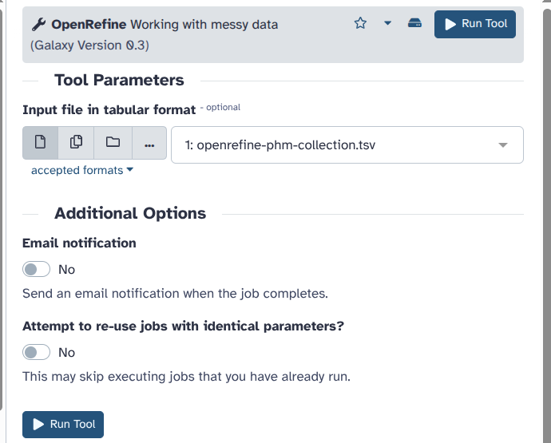
>
> 3. After around 30 seconds, using the interactive tools section on the left panel, you can open OpenRefine by clicking on its name. Make sure to wait until you see the symbol with an arrow > pointing outside the box that allows you to start OpenRefine in a new tab.
>
>    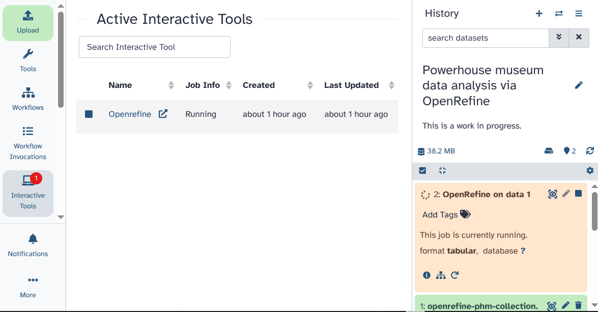
>
> 4. Here, you can see the OpenRefine GUI. Click on `Open Project`.
>
>    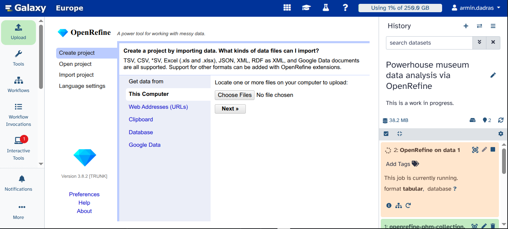
>
> 5. Click on `Galaxy file`. If the file does not appear, you may have started OpenRefine before it was fully loaded. Retry steps 3 and 4, and the file should be visible.
>
>    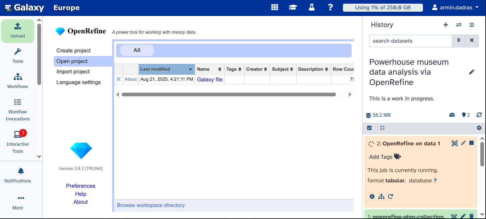
>
> 6. You can see the data loaded for you.
>
>    
>
{: .hands_on}

> <question-title></question-title>
>
> 1. How many rows does this table have?
>
> > <solution-title></solution-title>
> >
> > 1. 75809
> >
> {: .solution}
{: .question}

Great, now that the dataset is in OpenRefine, we can start cleaning it.

## Remove blank rows

> <hands-on-title>Removing the blank rows</hands-on-title>
>
> 1. Click on the triangle on the left of `Record ID`.
>
>    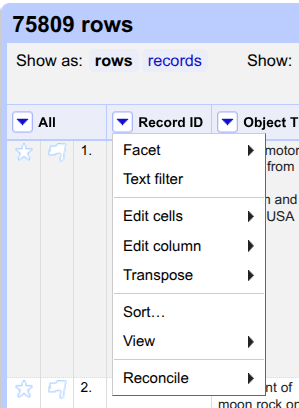
>
> 2. Click on `Sort...`.
>
> 3. Select `numbers` and click on `OK`.
>
>    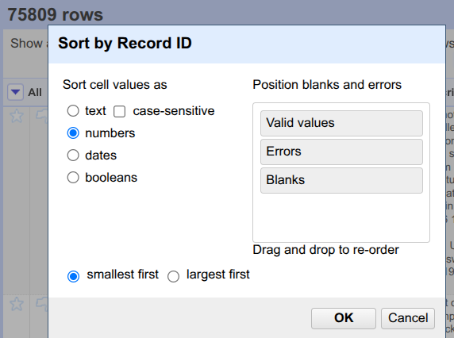
>
> 4. Above the table, click on `Sort` and select `Reorder rows permanently`.
>
>    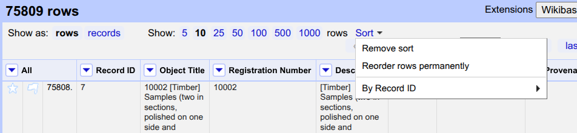
>
> 5. Click on the triangle left of the `Record ID` column. Hover over `Edit cells` and select `Blank down`.
>
>    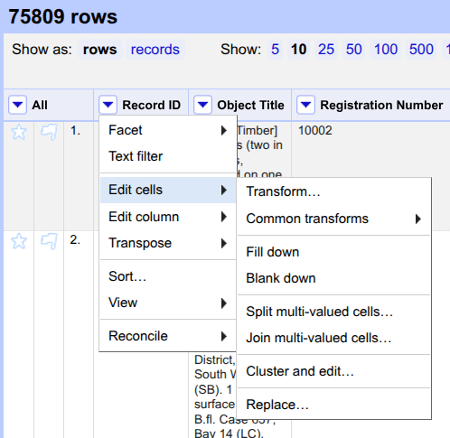
>
> 6. Click on the triangle left of the `Record ID` column. Hover over `Facet`, then move your mouse to `Customized facets` and select `Facet by blank (null or empty string)`.
>
>    
>
> 7. On the left, a new option appears under `Facet/Filter` with the title `Record ID`. Click on `true`.
>
>    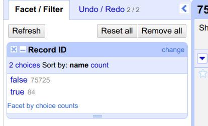
>
> 8. Click on the triangle to the left of the column called `All`. Hover over `Edit rows`, and select `remove matching rows`.
>
>    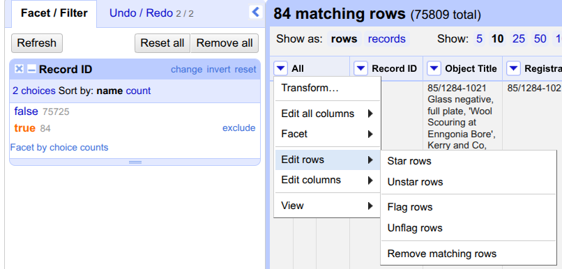
>
> 9. Close the `Facet` by clicking on the cross (x) to see all rows.
>
{: .hands_on}

> <question-title></question-title>
>
> 1. How many rows have been removed?
>
> > <solution-title></solution-title>
> >
> > 1. 84
> >
> {: .solution}
{: .question}

The dataset does not contain any more blank rows now. But we need to do more cleaning to improve the dataset.

## Use GREL

> <hands-on-title>Find and replace typos using GREL</hands-on-title>
>
> To remove the occurance of double pipe \|\| from the file we can do the following:
> 1. Click on the triangle on the left of `Categories` and select `Text filter`.
> 2. On the left, using the `Facet/Filter` section, search for the occurrence of \| and \|\|. There are 71061 rows with \| and 9 rows with \|\|. We want to remove these 9 lines as they are there by mistake.
> 3. Click on the triangle on the left of `Categories`, hover over `edit cells`, and click on `Transform...`.
> 4. In the new window, use the following text `value.replace('||', '|')` as "Expression" and click on `OK`.
>
>    
>
>    We can also remove the double occurrence of the same for different entries as follows:
>
> 5. Click on the triangle on the left of `Categories`, hover over `edit cells`, and click on `Transform...`.
>
>    
>
>    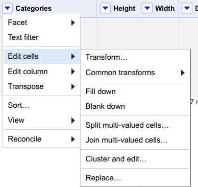
>
> 6. In the new window, use the following text `split('|').uniques().join('|')` as "Expression" and click on `OK`.value.
>
{: .hands_on}

> <question-title></question-title>
>
> 1. How many cells had duplicated categories?
>
> > <solution-title></solution-title>
> >
> > 1. 1,668
> >
> {: .solution}
{: .question}

## Atomization

> <hands-on-title>Atomization</hands-on-title>
>
> Once the duplicate records have been removed, we can have a closer look at the Categories column. Different categories are separated from each other by pipe (\|). Each entry can have more
> than one category. In order to analyze in detail the use of the keywords, the values of the Categories column need to be split up into individual cells on the basis of the pipe character.
> 1. Click on the triangle on the left of `Categories`, hover over `edit cells`, and click on `Split multi-valued cells...`.
>
>    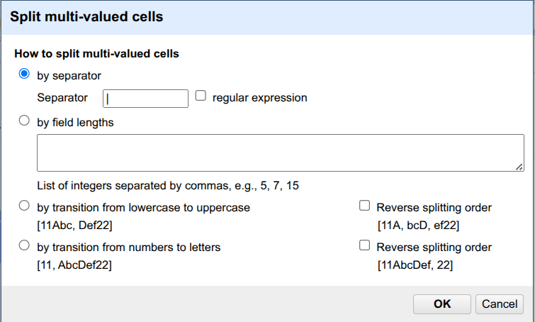
>
> 2. Define the `Separator` as `\|` (pipe). Click on `OK`.
>
>    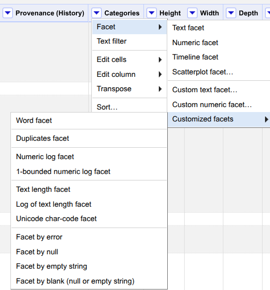
>
{: .hands_on}

Are you ready for a little challenge? Let's investigate the categories column of the museum items.

> <question-title></question-title>
>
> 1. How many rows do you have after atomizing the categories column?
> 2. How many entries do not have any category?
>
> > <solution-title></solution-title>
> >
> > 1. 168,476
> > 2. Click on the triangle on the left of `Categories` and hover over `facet` and move your mouse over `Customized facets`, and click on `Facet by blank (null or empty string)`. The `true` value for blank entries is 447.
> >
> {: .solution}
{: .question}

Now, let's use faceting based on text.

## Faceting

> <hands-on-title>Atomization</hands-on-title>
>
> 1. Click on the triangle on the left of `Categories`, hover over `facet`, and click on`Text facet`.
> 2. On the left panel, it mentions the total number of choices. The default value of `count limit` is low for this dataset, and we should increase it. Click on `Set choice count limit`.
>
>    
>
> 3. Enter `5000` as the new limit and click on `Ok`.
>
>    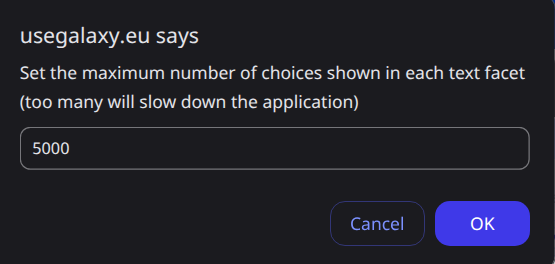
>
> 4. Now, you see all categories. Click on `count` to see the categories sorted in descending order.
>
>    
>
{: .hands_on}

> <question-title></question-title>
>
> 1. What are the top 3 categories? How many items are associated with each of them?
>
> > <solution-title></solution-title>
> >
> > 1. Numismatics (8011), Ceramics (7389), and Clothing and Dress (7279)
> >
> {: .solution}
{: .question}


## Clustering

The clustering allows you to solve issues regarding case inconsistencies, incoherent use of either the singular or plural form, and simple spelling mistakes.

> <hands-on-title>Clustering of similar categories</hands-on-title>
>
> 1. Click on the `Cluster` button on the left in the `Facet/Filter` tab.
> 2. Use `Key collision` as clustering method. Change the Keying function to `n-Gram fingerprint` and change the n-Gram size to `3`.
>
>    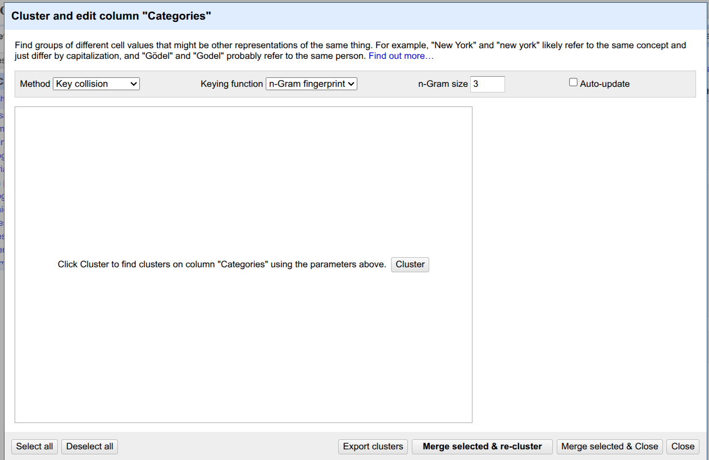
>
> 3. Click on the `cluster` button in the middle window.
>
>    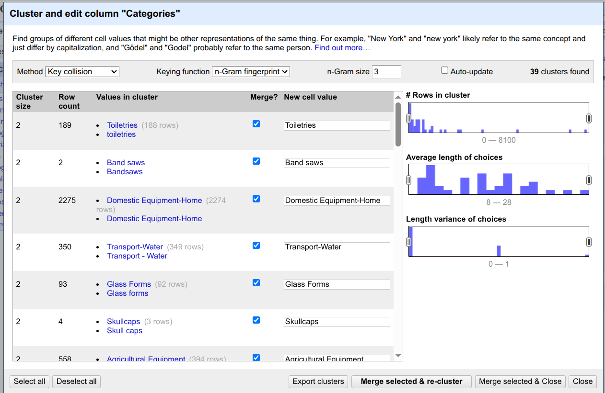
>
> 4. Here, you can see different suggestions from OpenRefine to cluster different categories and merge them into one. In our tutorial, we merge all of the suggestions by clicking on `select > all` and then clicking on `Merge selected and re-cluster`.
>
>    
>
> 5. Now, you can close the clustering window by clicking on `close`.
>
>    Be careful! Some methods are too aggressive, so you might end up clustering values that do not belong together. Now that the values have been clustered individually, we can put them back together in a single cell.
> 6. Click the Categories triangle and hover over the `Edit cells` and click on `Join multi-valued cells`.
> 7. Choose the pipe character (`\|`) as a separator and click on `OK`.
> The rows now look like before, with a multi-valued Categories field.
>
{: .hands_on}

When you’re happy with your analysis results, choose whether to export the dataset into your Galaxy history or download it directly onto your computer.

## Exporting your data back to Galaxy

> <hands-on-title>Exporting the results and history</hands-on-title>
>
> 1. Click on `Export` at the top of the table.
> 2. Select `Galaxy exporter`. Wait a few seconds. In a new page, you will see a text as follows: "Dataset has been exported to Galaxy, please close this tab". When you see this, you can close that tab. Alternatively, you can download your cleaned dataset in various formats such as CSV, TSV, and Excel. You can also close the extra tab that contains OpenRefine and click on the orange item `OpenRefine on data [and a number]`. You do not need it for your next steps
>
>    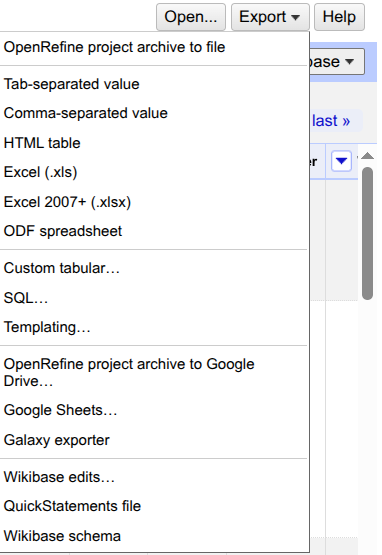
>
> 3. You can find a new dataset in your Galaxy History (with a green background) that contains your cleaned dataset for further analysis.
> 4. You can click on the eye icon () and investigate the table.
>
>    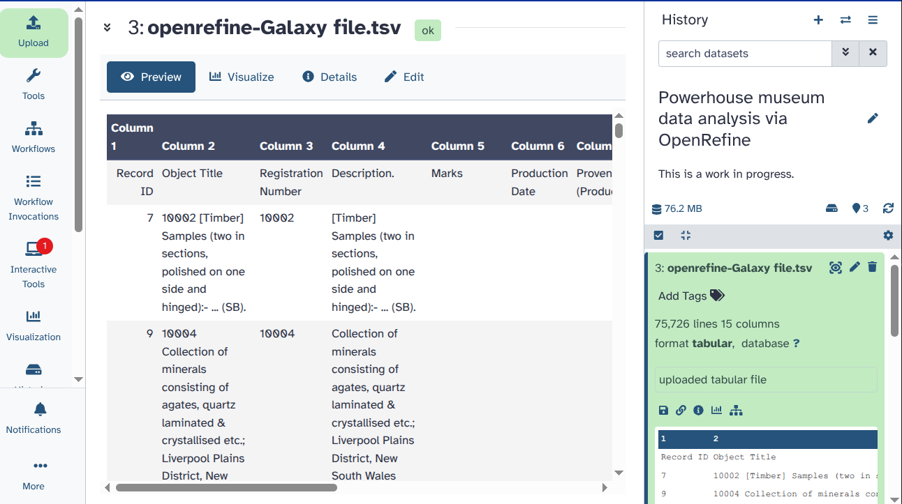
>
{: .hands_on}

> <hands-on-title>Exporting the results and history</hands-on-title>
> Additionally, you can download the tasks you performed using OpenRefine in JSON format. This way, you can import it later and reproduce the exact same analysis. To do so:
> 1. Click on `Undo/Redo` on the left panel.
> 2. Click on `Extract...`.
>
>    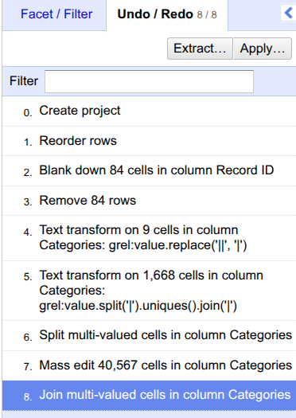
>
> 3. Click on the steps that you want to extract. Here, we selected everything.
> 4. Click on `Export`. Give your file a name to save it on your computer.
>
> 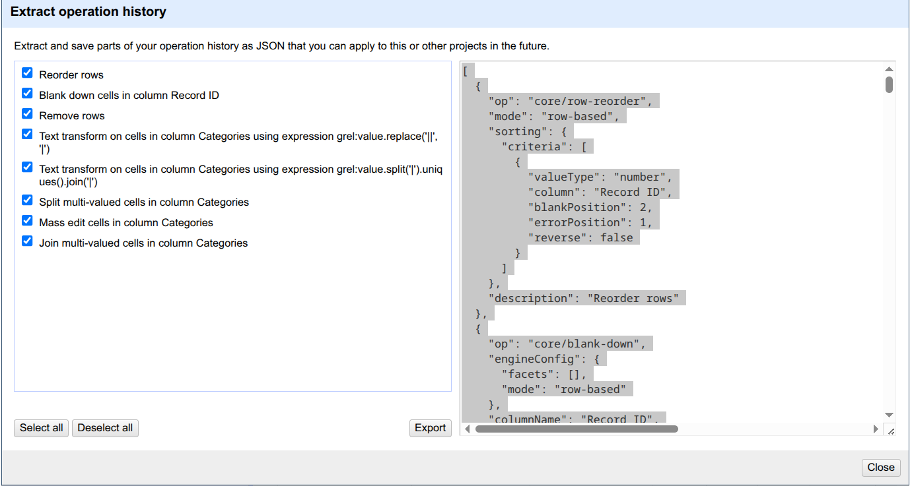
>
{: .hands_on}

# Run a Galaxy Workflow on your cleaned data

Congratulations, you have successfully cleaned your data and improved its quality!
But what can you do with it now?
This depends on your aims as a researcher. For us, it is interesting to extract further information from the data.
To make it easy for you, we created a so-called workflow, which links all the tools needed to do this analysis.
We wanted to know, from what year the museum had the most objects and what they were.
You can follow along and answer those questions with us, or explore the Galaxy tools on your own, to adapt the analysis to your needs.
In this case, be sure to check out our other tutorials, particularly the introductory ones.

## How to find and run existing workflows

> <hands-on-title>Run a Galaxy workflow on your dataset</hands-on-title>
>
> There are different ways to import or create a workflow to Galaxy. For example, you can import a workflow from the registered workflows on [WorkflowHub](https://workflowhub.eu/) which is a registry for describing, sharing, and publishing scientific computational workflows. To do that, you have to navigate to the [WorkflowHub](https://workflowhub.eu/) and find the workflow of interest. In this tutorial, we are working [with this workflow](https://workflowhub.eu/workflows/1884?version=1). When you open the link to this workflow on WorkflowHub, you see the following page:
>
> 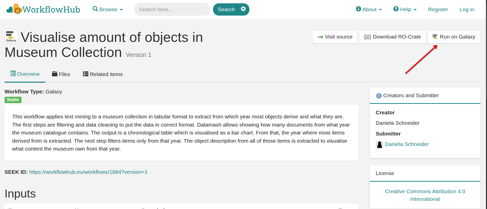
>
> Please click on the `Run on Galaxy` button on top right. After doing this, you will be redirected to your Galaxy account and see the workflow automatically in your middle panel as follows:
>
> 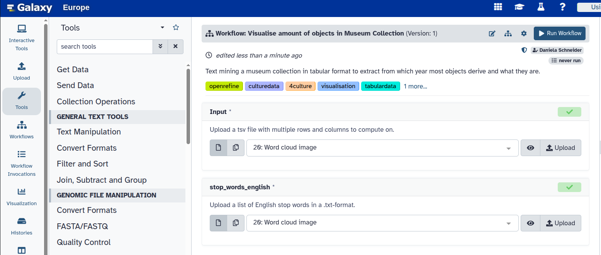
>
> Let's assume that you have imported a workflow to your Galaxy account.
> 1. You can find all workflows available to you by clicking on the Workflows Icon () on the left panel.
>
>    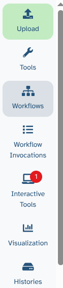
>
> 2. Then, you can select and run different workflows (if you have any workflows in your account). Here, let's click on the Run button () of the workflow we provided to you in this tutorial.
>
>    
>
> 3. Determine the inputs as follows:
>    Input: `openrefine-Galaxy file.tsv`
>    stop_words_english: `stop_words_english.txt`, which is the file we provided to you in this tutorial.
>
>    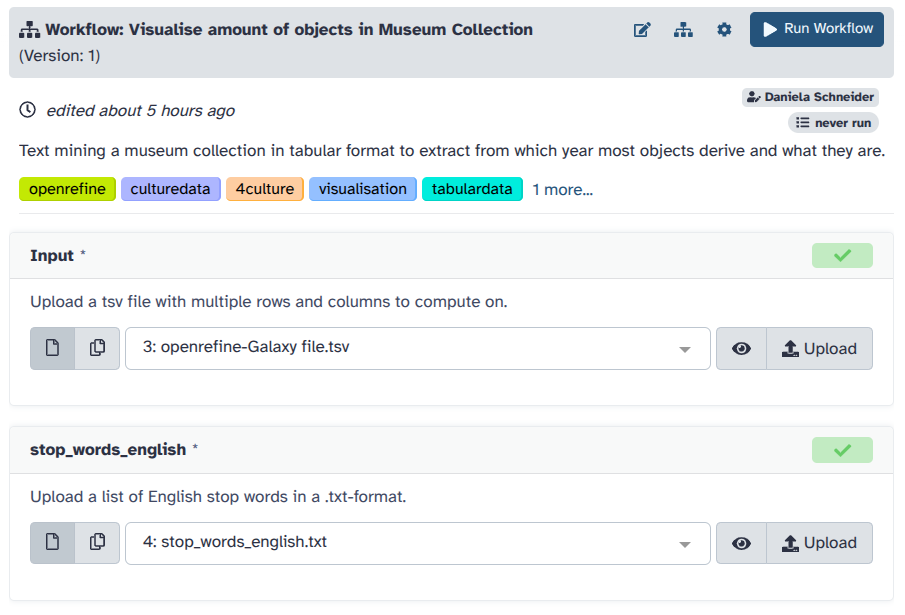
>
> 5. Click on the `Run Workflow` button at the top.
> 6. You can follow the stages of different jobs (computational tasks). They will be created, scheduled, executed, and completed. When everything is green, your workflow has run fully and the results are ready.
>
>    
>
{: .hands_on}

What can you see here? To follow along, we made all substeps of the task available as outputs. To answer our question of what year most elements in the museum derive from, we first cut the column of production time from the table and filter only dates from the table that derive from specific years, not year ranges. Regular expressions help clean remaining inconsistencies in the dataset. Sorting the production date in descending order reveals that one faulty dataset that is supposed to be created in 2041 is part of the table. We remove it. Datamash allows for summing up how many elements came to the museum in what year.  The ascending order, we visualise in a bar chart. To find out from what year most objects derive, we use another sorting order. We parse the input as a conditional statement to search for object descriptions from the objects of that year. In our case, this is 1969. From all object descriptions from 1969, we create a word cloud using the offered stop word list.
As a result, we get that most objects from the museum are negatives from Davis Mist, which he created in that year and gave to the museum.

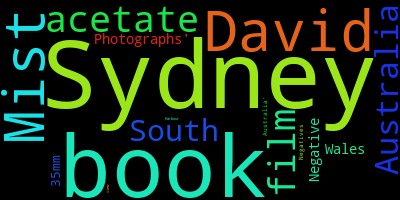

# Conclusion

Congratulations! You used OpenRefine to clean your data and ran a workflow from Galaxy with your results! You now know how to do basic steps in Galaxy, run OpenRefine as an interactive tool and get your data from Galaxy to OpenRefine and back. On the way, you have learned basic data cleaning, like facetting, to enhance the quality of your data. To extract further information from the cleaned data, running a pre-designed workflow showed you a glimpse into Galaxy. Of course, you can always do your own analysis with the tools most useful for you, instead.
