This tutorial is designed to guide you through the annotation of audio data via the NEAL interactive tool. 

NEAL (Nature+Energy Audio Labeller)  is an open-source interactive audio data annotation tool. Built using R and the associated R Shiny framework, the tool provides a reactive environment where users can quickly annotate audio files and adjust settings which automatically change the corresponding elements of the user interface. The app has been designed with the goal of having both expert birders and citizen scientists contribute to acoustic annotation projects .

The data we will work with in this tutorial is a 0:43min recording of a common blackbird (Turdus merula) recorded in Armenia above Alaverdi town. For more information, you can see metadata on the [xeno-canto site](https://xeno-canto.org/explore?query=nr:1008421).   

In this tutorial, you will learn how to import an audio file into Galaxy, run the NEAL interactive tool, annotate the spectrogram, and export the resulting annotation file.  

Many of you may be new to Galaxy or to audio annotation, so we will go step by step. If you're new to Galaxy, feel free to check out other tutorials like [A short introduction to Galaxy]() or [Galaxy Basics for everyone]().

> <agenda-title></agenda-title>
>
> In this tutorial, we will cover:
>
> 1. TOC
> {:toc}
>
{: .agenda}

# Get data

So, the first step is to your audio file into Galaxy. 
In this tutorial, we will use the recording mentioned earlier, but feel free to use your own file(s). The NEAL interactive tool allows working on multiple files, so you can upload the number of files you want.

> <hands-on-title> Data Upload </hands-on-title>
>
> 1. Create a new history for this tutorial and give it a name, e.g., "NEAL tutorial" for you to find it again later if needed.
>
>    
>
>    
> 
> 2. Import the example audio file from [xeno-canto](https://xeno-canto.org/1008421/download)
>    Audio file :
>    
>    ```
>    https://xeno-canto.org/1008421/download
>    ```
>    
>    
>
>    
>
> 3. Rename the dataset (default name: *Download*) to something more explicit, e.g., **1008421.wav** to have a name linked to the xeno-canto identifier.
>
>    
>    
> > <tip-title>Provide a dataset name during import</tip-title>
> >
> >   Note that you also can provide the **1008421.wav** filename on the "Paste/Fetch data" upload module to avoid renaming after importing the file.
> >
>{: .tip}
>    
> 4. Make sure the dataset's datatype is `.wav`, as the tool only supports this format.
>
>    
>
> 5. You can add a tag to your dataset if you need to distinguish multiple datasets in your history.
>
>    
>
{: .hands_on}


# Run NEAL interactive tool

All the work will be done inside the NEAL interactive tool, so let's run it.

> <hands-on-title> Run NEAL interactive tool</hands-on-title>
>
> 1.  with the following parameters:
>    -  *"Input sound data file(s) in wav format"*: 1008421.wav
>    -  *"Do you already have a labels file?"*: Start with a fresh labels file
>
> 2. Wait for the tool to deploy it. It may take few a minutes, but you will see a message like this: 
>
>      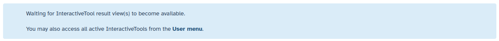
>
> 3. You can now display the interactive interface. You can display it with different methods:
>
>    1. You can open it clicking ont the status message "Open"
>
>      
>    
>    2. You can open it by clicking on the link next to the red square in the "Launch and manage interactive tool" panel.
>
>      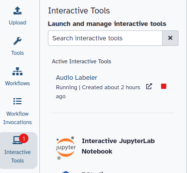
>    
>    3. You can also click on the eye icon on the "yellow" "NEAL on dataX" history dataset.
>
>      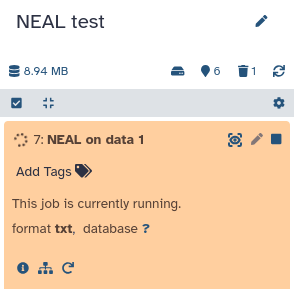
>
{: .hands_on}

# Inside the NEAL interactive tool

Congratulations 🎉 You are now inside the NEAL interface. Let’s explore the main features.

## Start session

To start annotating your audio file, you will need to start the session.

> <hands-on-title> Start session </hands-on-title>
>
> 1. Click on the **user icon** (top left).
>
> 2. Click the green **Start labelling** button.  
>       
>
> 3. The **sonogram** of the audio file will appear.  
>     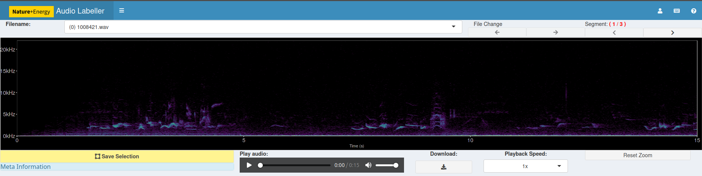
>
{: .hands_on}

## Listen to the audio

> <hands-on-title></hands-on-title>
>
> Use the **play button** below the sonogram to listen to the audio recording.  
> You can pause, stop, or replay as needed. And, adjust playback speed if necessary.
>
> > <warning-title></warning-title>
> >
> > As you can see, regardless of the total duration of your file, NEAL lets you listen to the audio in **15-second segments**.
> >
> {: .warning}
>
{: .hands_on}


## Annotate the audio file 

### Add a label

If this is your first annotation, you will need to **create a label** (e.g. "Blackbird song", "Noise", etc.). 

> <hands-on-title> Add a label </hands-on-title>
>  
>  1. Type the label name (e.g. *Turdus merula*).  
>  2. Click the **Add** button in the *Category buttons* section.  
> 
>     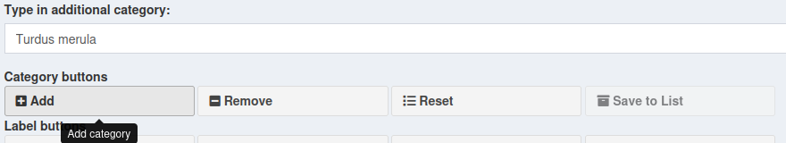
>
{: .hands_on}

For this tutorial, you will only need the **Turdus merula** label you just added and the **Insect Noise** label, already present in the *Class List: Richfield*.

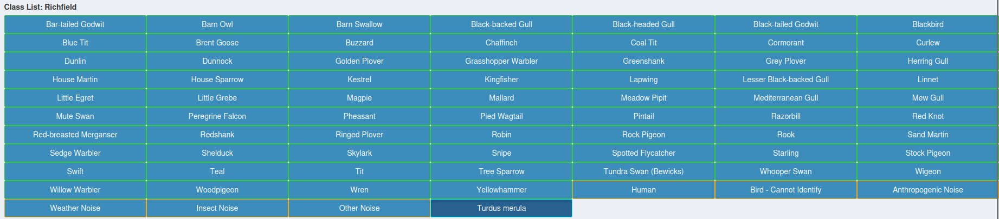

### Select a time/frequency region

> <hands-on-title></hands-on-title>
>
> 1. Click and drag on the sonogram to select a **time–frequency region**.
>
>    The selected area will be highlighted. Here we can try to two different frequencies ranges : 
>
>      - One selection between 1 kHz and 10 kHz:
>       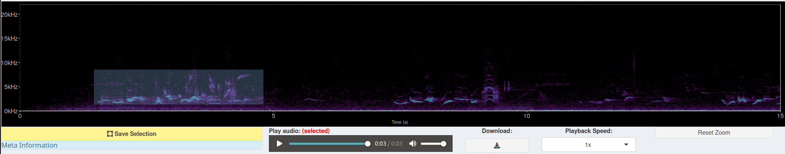
>
>      - One selection between 0kHz and 1kHz:
>       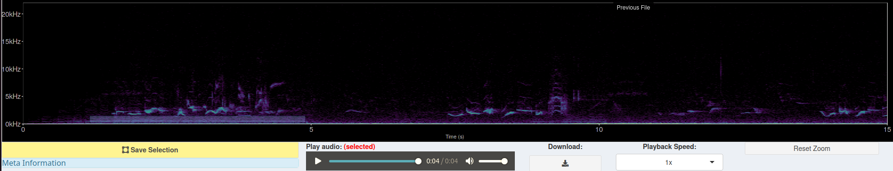
>
> > <question-title></question-title>
> >
> > 1. Do you hear different sounds between the two frequencies we select? 
> >
> > > <solution-title></solution-title>
> > >
> > > 1. There are two sounds: 
> > >   - In the higher frequencies, you can hear *Turdus merula* sounds
> > >   - In the lower frequencies, you can hear a flying insect noise.
> > >
> > {: .solution}
> {: .question}
{: .hands_on}

### Annotate the selection

After selection of an area, you can assign it a label. 

> <hands-on-title> Add a label to the selected area </hands-on-title>
>
> 1. After selecting a region, choose the label that matches what you hear in the **Class list**.
>
> 2. Click on the **Save selection** button 
>       - This will link the time–frequency selection to a label. 
>       - You can now annotate the *Turdus merula* sound...
>         
>     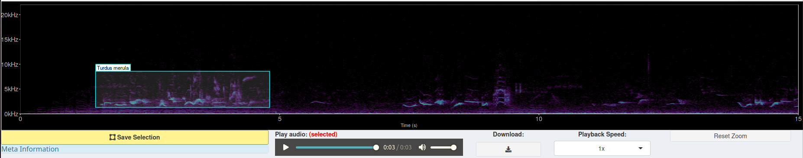
> 
>       - ... and the insect noise we selected in the previous step.
> 
>     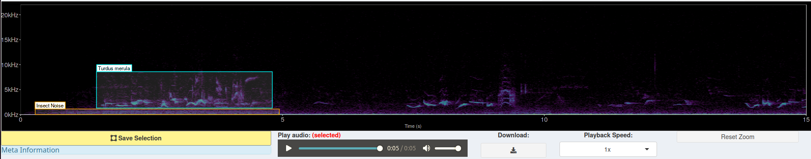
>
{: .hands_on}

## Download the label file

Once you have finished annotating your file you can save and download your annotations. 

> <hands-on-title></hands-on-title>
>
> 1. Export the labels by downloading the CSV file containing your annotations.
>    Simply click the **download** button in the **Label buttons** area:
>
>    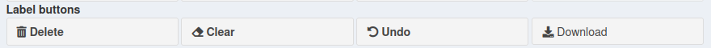
>
>    This CSV file can be re-used later to resume annotation.
>
{: .hands_on}

## Exit the interactive tool

After saving your file you can exit the NEAL interactive tool. 

> <hands-on-title></hands-on-title>
>
> 1. Click on the **End Labelling** button to end labelling
>
>    Your sonogram will disappear. 
>
> 2. Click on the **log out** button before leaving the NEAL interface.  
>    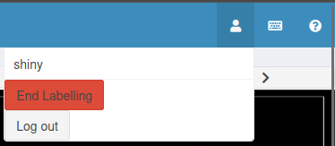
>
{: .hands_on}

## Shutdown the tool

Back on Galaxy, you can now Shutdown the NEAL interactive tool to free resources. 

> <hands-on-title></hands-on-title>
>
> To do so you can :
>
> 1. Click on the square on the tool running in your galaxy history.
>
>  
> 
> 2. Click on the red square in the "launch and manage interactive tools" panel.  
>
>  
>
> > <warning-title></warning-title>
> >
> > Don't worry if the NEAL tool appears in red in your history after shutting it down.
> > This is due to how Galaxy handles the termination of interactive tools and won't impact your work.  
> >
>{: .warning}
{: .hands_on}

# Rerun NEAL interactive tool with a previous labels file

If you need to continue your work on this audio file later you can restart the NEAL interactive tool using the CSV file containing your previous labels. 

> <hands-on-title> Rerun NEAL interactive tool </hands-on-title>
>
> 1.  with the following parameters:
>    -  *"Input sound data file(s) in wav format"*: 1008421.wav
>    -  *"Do you already have a labels file?"*: Load a previous labels file
>    -  *"Input sound data labels file in csv format"*: my_labels_file.csv
>
{: .hands_on}

You can now continue your work from where you left off.  

> <warning-title></warning-title>
>
> Using it into Galaxy, NEAL does not automatically save labels in its **Class List**.  
> Labels are stored only inside the sonogram annotations.  
> This means you may need to recreate/re-add labels before adding new annotations.  
>
{: .warning}

# Conclusion

👏 Congratulations! You have completed the NEAL tutorial.  

You have learned how to:

  - Import audio data into Galaxy  
  - Launch and use the NEAL interactive tool  
  - Annotate audio files  
  - Export and re-use annotation files  

If you have questions or encounter issues, please check the documentation or contact the Galaxy community for support.
