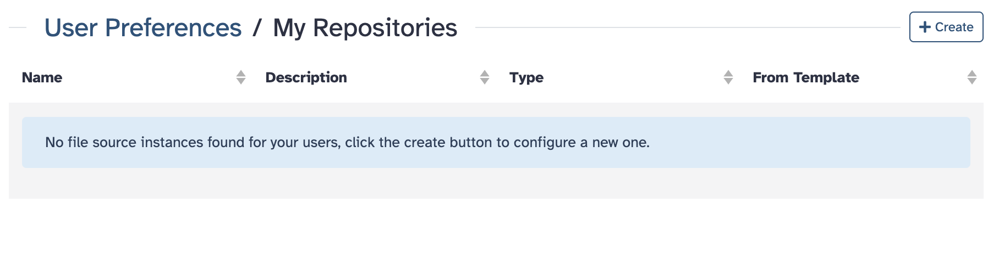
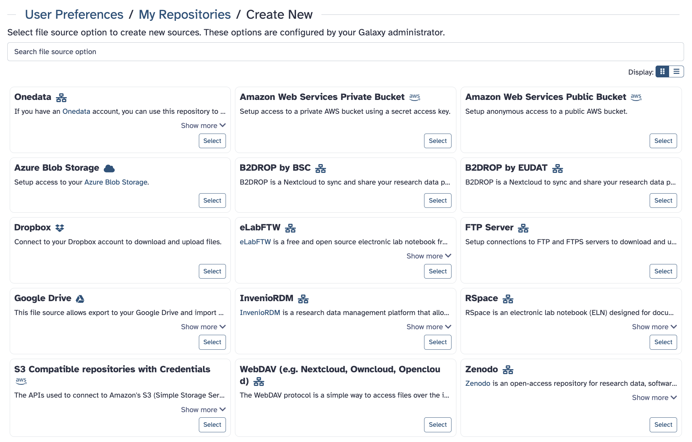
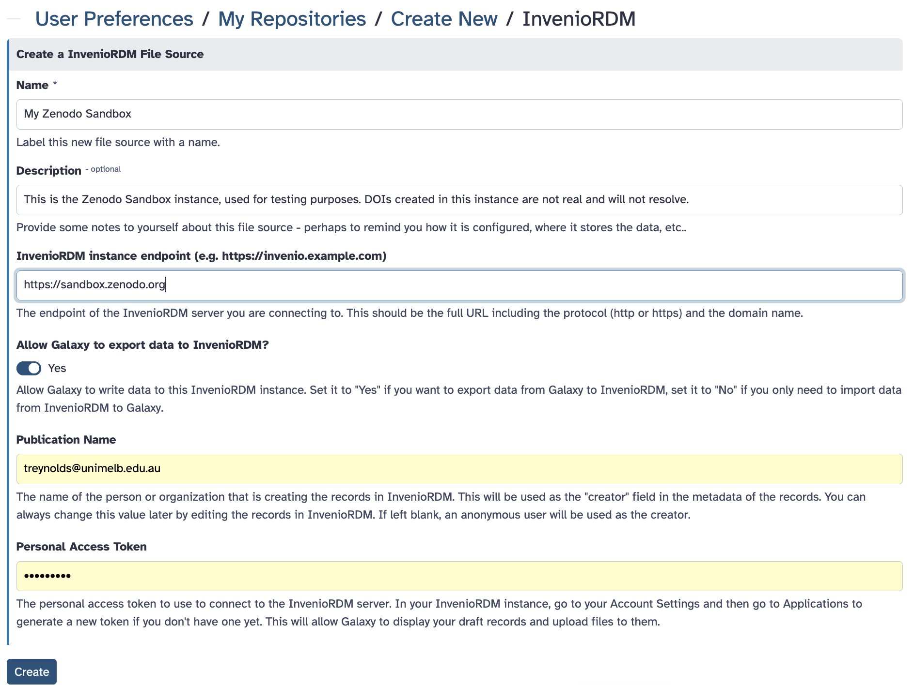
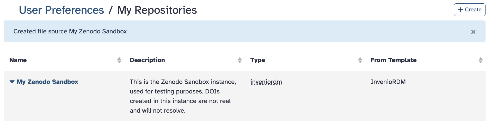
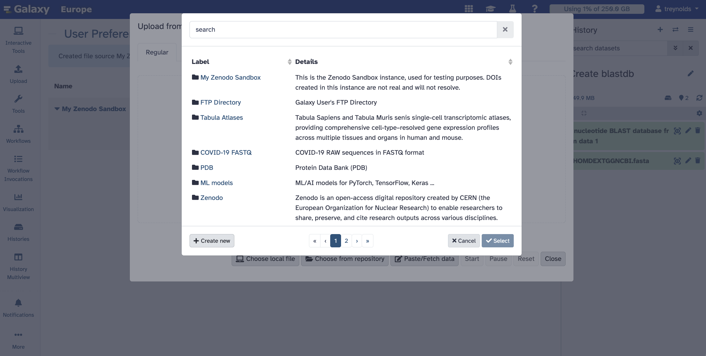

# Overview

Discover a more streamlined approach to research data management with Galaxy's integration with InvenioRDM-compatible repositories.

> <agenda-title></agenda-title>
> In this tutorial we will deal with:
>
> 1. TOC
> {:toc}
>
{: .agenda}

# Introduction

Zenodo can be connected to Galaxy, offering a streamlined experience in managing and analyzing your research data. With this integration, you can export research results directly from Galaxy to Zenodo, and import files from Zenodo into Galaxy for reproducible analysis workflows.

## Zenodo

[Zenodo](https://zenodo.org/) is an open repository for all scholarship, enabling researchers from all disciplines to share and preserve their research outputs, regardless of size or format. Free to upload and free to access, Zenodo makes scientific outputs of all kinds citable, shareable and discoverable for the long term.

It's worth noting that [Zenodo, in October 2023, migrated to InvenioRDM as its underlying technical platform](https://blog.zenodo.org/2023/10/13/2023-10-13-zenodo-rdm/). This move not only makes this integration fully compatible with Zenodo but also signals a commitment to enhanced features and scalability, further bolstering the integration's potential benefits for researchers.

# Getting started

## Setting up your PAT (Personal Access Token)

To be able to upload files and browse protected records, you need to create an account and set up your PAT (Personal Access Token). To create a new token:

> <hands-on-title>Create Your Personal Access Token</hands-on-title>
>
> 1. Open [Zenodo](https://zenodo.org) and `Log in` or create an account.
> 
> 2. Go to your `user settings` in the top right corner and select the `Applications` tab.
>
> 3. Then, click on `New token` and give it a name and the necessary permissions.
>
>    
>
> > <comment-title></comment-title>
> > You will only be able to view and copy the access token when it is first created, so you should copy and securely store the token at this time. If you lose your copy of the access token, then you will need to generate a new one.
> >
> {: .comment}
> 
{: .hands_on}

## How to connect Zenodo to Galaxy 25.0

The new `Manage Your Repositories` section is available under `User → Preferences`. We will integrate the Zenodo Sandbox instance for demonstration purposes, but you can also configure your institution's InvenioRDM instance. Here’s how it works:

> <hands-on-title>Connecting to Galaxy</hands-on-title>
> 
> 1. Navigate to `User → Preferences → Manage Your Repositories`. If you haven't set up any integrations yet, you'll see an empty list.
> 
>
> 2. Click `+ Create` to configure a new integration. You'll see a list of available integrations, including `S3, Dropbox, InvenioRDM, Zenodo`, and more (depending on your Galaxy server).
> 
> 
> 3. Select `Zenodo` to configure it and enter your **credentials or relevant connection details**. (This will be the access token created in the previous section if using the Zenodo sandbox.)
> 
> 
> 4. Once set up, your InvenioRDM integration, in this case, `My Zenodo Sandbox`, will appear in the list where you can manage or delete it.
> 
> 
> 5. Your selected integrations will appear first when browsing import/export locations. You can find them by clicking on the `Upload` button in the activity bar.
> 
{: .hands_on}

> <details-title>Do you want to add a different repository to Galaxy?</details-title>
> 
> There are a number of additional repository types that you can connect to Galaxy and use to import and export data.
>
> 
>
{: .details}

# Importing records and files into Galaxy

Once you have connect Zenodo to Galaxy, you will be able to import records and files stored in Zenodo into Galaxy.

> <hands-on-title>Importing Files</hands-on-title>
> 
> 1. Open the Upload tool, and select `Choose remote files`
> 
>
> 2. Search for the Zenodo instance. Remember that this will only appear if the Zenodo plugin is configured to connect to Zenodo in your Galaxy instance.
> 
>
{: .hands_on}

Once you have selected Zenodo, you can browse public records and import them into your Galaxy history. You can choose to import the full record or individual files in the same way you would import files from any other remote source.

# Exporting your Galaxy history

You can export your history directly to Zenodo. A benefit of publishing your history on Zenodo is that Zenodo will generate a DOI for your history. You can then include this DOI in your publication and it can be used by other researchers to cite your work.

> <hands-on-title>Exporting a History</hands-on-title>
> 
> 1. From the history menu 
, you can select `Export History to File`
>
> 2. Then choose `to My Zenodo`. 
> 
> 3. You can decide whether to create a new record or upload the history to an existing draft record.
> 
>
{: .hands_on}

You can always edit the record metadata directly from the Zenodo web interface. Once you are satisfied with the record, you can publish it, generating a DOI that others can use to cite your research.

# Conclusion

In this tutorial, we have connected Zenodo to a Galaxy instance. We have also imported files and records from Zenodo into Galaxy and exported a Galaxy History to Zenodo.

# References

1. [InvenioRDM and Zenodo integration in Galaxy](https://galaxyproject.org/news/2024-05-03-inveniordm-integration/)
2. [Updates to your InvenioRDM and Zenodo integration in Galaxy
   ](https://galaxyproject.org/news/2025-03-10-inveniordm-integration-update/)
