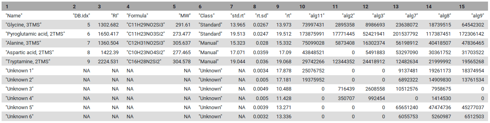

---
layout: tutorial_hands_on
draft: false

title: 'Mass spectrometry: GC-MS analysis with the metaMS package'
level: Introductory
zenodo_link: 'https://zenodo.org/records/16538501' 
questions: 
- What are the main steps for gas chromatography-mass spectrometry (GC-MS) data processing for untargeted metabolomic analysis?
- How to conduct metabolomic GC-MS data analysis from preprocessing to annotation using Galaxy?
objectives: 
- To confirm you have already comprehend the diversity of MS pre-processing analysis. 
- To discover the principal functions of the metaMS package for GC-MS data processing available in Galaxy.
- To evaluate the potential of two Galaxy-based workflow approaches when dealing with GC-MS metabolomic analysis. 
time_estimation: 2H 
key_points: 
- To process untargeted GC-MS metabolomic data preprocessing, you need a large variety of steps and tools.
- Although main steps are standard, various ways to combine and to set parameters for tools exist, depending on your data.
- Resources are available in Galaxy, but do not forget that you need appropriate knowledge to perform a relevant analysis. 
requirements:
- type: "internal"
  topic_name: metabolomics
  tutorials:
    - lcms
    - gc_ms_with_xcms
contributions:
  authorship: 
    - jsaintvanne
    - yguitton
  editing:
    - yguitton
    - melpetera
    - jsaintvanne
  testing:
    - workflow4metabolomics
  funding:
    - metabohub
    - rfmf
    
--- 

You may already know that there are different types of *-omic* sciences; out of these, metabolomics is most closely related to phenotypes. Metabolomics involves the study of different types of matrices, such as blood, urine, tissues, in various organisms including plants. It  focuses on studying the very small molecules which are called *metabolites*, to better understand matters linked to the metabolism. However, studying metabolites is not a piece of cake since it requires several critical steps which still have some major bottlenecks. Metabolomics is still quite a young science, and has many kinds of specific challenges.

One of the three main technologies used to perform metabolomic analysis is **Gas-Chromatography Mass Spectrometry** (GC-MS). Data analysis for this technology requires a large variety of steps, ranging from extracting information from the raw data, to statistical analysis and annotation. Many packages in R/Python are available for the analysis of GC-MS or LC-MS (Liquid-Chromatography Mass Spectrometry) data - for more details see the reviews by  and .

This tutorial explains the main steps involved in untargeted **GC-MS** data processing. To do so we focus on some open-source solutions integrated within the Galaxy framework, namely **XCMS** and **metaMS**. The selected tools and functionalities only covers a small portion of available tools but allow to **perform a complete GC-MS analysis** in a single environment.
In this tutorial, we will learn how to (1) extract features from the raw data using **XCMS** (), (2) deconvolute the detected features into spectra with **metaMS** () and (3) annotate unknow spectra using spectral database comparison tools.

To illustrate this approach, we will use data from . Due to time constraints in processing the original dataset, a limited subset of samples was used to illustrate the workflow. This subset (see details below) demonstrates the key steps of metabolomics analysis, from pre-processing to annotation. Although the results derived from this reduced sample size may not be scientifically robust, they provide insight into essential methodological foundations of GC-MS data-processing workflow.

> <details-title> About the data - Algae samples </details-title>
>
> The objective of the study conducted by Dittami *et al.* was to investigate the adaptation mechanisms of the brown algae *Ectocarpus* to low-salinity environments. The research focused on examining physiological tolerance and metabolic changes in freshwater and marine strains of *Ectocarpus*. Using transcriptomic (gene expression profiling) and metabolic analyses, the authors identified significant, reversible changes occurring in the freshwater strain when exposed to seawater. Both strains exhibited similarities in gene expression under identical conditions; however, substantial differences were observed in metabolite profiles.
> 
> The study utilized a **freshwater strain** of Ectocarpus and a **marine strain** for comparative analysis. The algae were cultured in media with varying salinities, prepared by diluting natural seawater or adding NaCl. The algae were acclimated to these conditions before extraction.
> 
> The six samples used in this training were analyzed by GC-MS (low resolution instrument). A marine strain raised in sea water media (2 replicates) and freshwater strains raised in either 5% or 100% sea water media (2 replicates each). The training dataset is [available on Zenodo](https://zenodo.org/records/16538501)
>
{: .details}

To process the GC-MS data, we can use several tools. One of these is  **XCMS** (), a general R package for untargeted metabolomics profiling. It can be used for any type of mass spectrometry acquisition (centroid and profile) and resolution (from low to high resolution), including FT-MS data coupled with a different kind of chromatography (liquid or gas). Because of the generality of packages like **XCMS**, several other packages have been developed to use the functionalities of **XCMS** for optimal performance in a particular context. The R package called **metaMS** () does so for the field of GC-MS untargeted metabolomics. One of the goals of **metaMS** was to set up a simple system with few user-settable parameters, capable of handling untargeted metabolomics experiments.
In this tutorial we use **XCMS** to detect chromatographic peaks within our samples. Once we have detected them, they need to be deconvoluted into mass spectra representing chemical compounds. For that, we use **metaMS** functions. To normalize the retention time of deconvoluted spectra in our sample, we compute the retention index using Alkane references and a dedicated function of **metaMS**. Finally, we identify detected spectra by aligning them with a database of known compounds. This can be achieved using an in-house built database in the common MSP format (`.msp`) (used in the NIST MS search program for example), resulting in a table of annotated compounds.


> <comment-title></comment-title>
> In Galaxy other GC-MS data processing workflows are available and may be of interest for more advanced Galaxy users (see the [Metabolomics section]()).
{: .comment}

> <agenda-title></agenda-title>
>
> In this tutorial, we will cover:
>
> 1. TOC
> {:toc}
>
{: .agenda}


# Data preparation and prepocessing

Before we can start with the actual analysis pipeline, we first need to download and prepare our dataset. Many of the preprocessing steps can be run in parallel on individual samples. Therefore, we recommend using the Dataset collections in Galaxy. This can be achieved by using the dataset collection option from the beginning of your analysis when uploading your data into Galaxy.


## Import the data into Galaxy

> <hands-on-title> Upload data </hands-on-title>
>
> 1. Create a new history for this tutorial
>
>    
>
> 2. Import the files from [Zenodo]({{ page.zenodo_link }}) into a collection:
>
>    ```
>    https://zenodo.org/records/16538501/files/alg11.mzML
>    https://zenodo.org/records/16538501/files/alg2.mzML
>    https://zenodo.org/records/16538501/files/alg3.mzML
>    https://zenodo.org/records/16538501/files/alg7.mzML
>    https://zenodo.org/records/16538501/files/alg8.mzML
>    https://zenodo.org/records/16538501/files/alg9.mzML
>    ```
>
>    
>
> 3. Make sure your data is in a **collection**. You can always manually create the collection from separate files:
>
>    
>
>    In the further steps, this dataset collection will be referred to as `input` (and we recommend naming this collection like that to avoid confusion).
>
> 4. Import the following extra files from [Zenodo]({{ page.zenodo_link }}):
>
>    ```
>    https://zenodo.org/record/16538501/files/reference_alkanes.csv
>    https://zenodo.org/record/16538501/files/W4M0004_database_small.msp
>    https://zenodo.org/record/16538501/files/sampleMetadata.tsv
>    ```
>
>    
>
>
>    > <comment-title> The extra files </comment-title>
>    >
>    > The three additional files contain the **reference_alkanes**, the **W4M0004_database_small**, and the **sampleMetadata**. Those files are auxiliary inputs used in the data processing and contain either extra information about the samples or serve as reference data for indexing and identification.
>    > 
>    > The **reference_alkanes** (`.tsv` or `.csv`) with retention times and carbon number or retention index is used to compute the retention index of the deconvoluted peaks. The alkanes should be measured in the same batch as the input sample collection.
>    > 
>    > The **W4M0004_database_small** (`.msp`) is a reference database used for the identification of spectra. It contains the recorded and annotated mass spectra of chemical standards, ideally from a similar instrument. The unknown spectra which can be detected in the sample can then be confirmed via comparison with this library. The specific library is an in-house library of metabolite standards extracted with **metaMS** .
>    > 
>    > The **sample metadata** (`.csv` or `.tsv`) is a table containing information about our samples. In particular, the tabular file contains for each sample its associated sample name, class (SW, FWS, etc.). It is possible to add more columns to include additional details about the samples (e.g : batch number, injection order...).
>    {: .comment}
>
{: .hands_on}

As a result of this step, you should have in our history a green Dataset collection  with all 6 samples `.mzML` files as well as three separate files with reference alkanes, reference spectral library, and sample metadata.

## Create the XCMS object

The first part of data processing is using the **XCMS** tool to detect peaks in the MS signal. For that, we first need to take the `.mzML` files and create a format usable by the **XCMS** tool.  (. ) takes as input our files and prepares `RData` files for the first **XCMS** step.


> <comment-title></comment-title>
> The **MSnbase readMSData**  function, prior to **XCMS**, is able to read files with open format as `mzXML`, `mzML`, `mzData` and `netCDF`, which are independent of the manufacturers' proprietary formats. Working with open MS data file format allows users to us tools developed outside of the MS instrument provider. This set of packages/functions gives modularity, and thus is particularly well adapted to define workflows, one of the key points of Galaxy.
> 
{: .comment}

> <hands-on-title> Create the XCMS object </hands-on-title>
>
> 1.  with the following parameters:
>    -  *"File(s) from your history containing your chromatograms"*: `input`
>
>    
>
>    The output should be `input.raw.RData`
>    
>    This dataset is a collection of `rdata.msnbase.raw` files. That `Rdata` file is necessary in the next step of the workflow.  It contains an internal R representation of **XCMS** objects.
>    
{: .hands_on}

As a result of this step, you should have in your history a new green dataset collection called `input.raw.RData` that will serve as input for the next processing step: **peak picking**.

# Peak detection using XCMS

The first step in the workflow is to detect the peaks in our data using **XCMS** functions. This part, however, is covered by a [separate tutorial]({{ site.baseurl }}/topics/metabolomics/tutorials/lcms-preprocessing/tutorial.html). Although the tutorial is dedicated to LC-MS data, it can also be followed for our GC-MS data. Therefore, in this section, we do not explain this part of the workflow in detail but rather refer the reader to the dedicated tutorial. Please also pay attention to the parameter values for individual Galaxy tools, as these can differ from the referred tutorial and are adjusted to our GC-MS dataset.

> <tip-title>Short-cut for Experts </tip-title>
> Since this step is already covered in a [separate tutorial]({{ site.baseurl }}/topics/metabolomics/tutorials/lcms-preprocessing/tutorial.html), it is possible to skip it. Instead, you can go directly to [Peak deconvolution]({{ site.baseurl }}/topics/metabolomics/tutorials/gcms/tutorial.html#processing-with-metams-option-1) step using a preprocessed **XCMS** object file prepared for you.
> >
> > <hands-on-title> Upload data </hands-on-title>
> > > 1. Import the following files from [Zenodo]({{ page.zenodo_link }}):
> > >
> > >    ```
> > >    https://zenodo.org/records/16538501/files/xset.merged.RData
> > >    ```
> > >
> > >    
> > > 
> > >     The format of uploaded file containing **XCMS** object should be `.RData`.
> > > 
> > >    
> {: .hands_on}
{: .tip}


The first step (*called peak picking*) is to extract peaks from each of your data files independently. For this purpose, we use the _MatchedFilter_ chromatographic peak detection algorithm implemented in .

 One Galaxy Training material already explains how to act with MS data. We encourage you to **follow this link and complete the corresponding tutorial**: [Mass spectrometry: LC-MS preprocessing with XCMS](). 
For GC-MS analysis you **don't really need to follow all of this previous tutorial** but for a better understanding of your data, it is recommended to try it with their test dataset.
Concerning the current GC-MS tutorial, you **just have to compute the following steps and specific parameters** described in the hands-on part below (please follow the parameter values below to obtain the same results during the training).


> <hands-on-title>Peak picking of GC-MS data with XCMS</hands-on-title>
>
> 1.  with the following parameters:
>    -  *"RData file"*: `input.raw.RData` (the output collection of files from the **MSnbase readMSData**  step)
>    - *"Extraction method for peaks detection"*: `MatchedFilter - peak detection in chromatographic space`
>        - *"Full width at half maximum of matched filtration gaussian model peak"*: `5`
>        - *"Step size to use for profile generation"*: `0.5`
>        - In *"Advanced Options"*:
>            - *"Maximum number of peaks that are expected/will be identified per slice"*: `500`
>            - *"Signal to Noise ratio cutoff"*: `2`
>            - *"Minimum difference in m/z for peaks with overlapping Retention Times"*: `0.5`
>
>
>    > <comment-title></comment-title>
>    >
>    > For GC-MS data in profile mode, use the *MatchedFilter* algorithm instead of the *CentWave* algorithm used in the LC-MS tutorial.
>    > For low-resolution GC-MS data, a larger m/z difference (0.5 Da) can be used to separate overlapping peaks. If you have high-resolution data (from GC-ToF or GC-Orbitrap), you can use a smaller m/z difference (0.01 Da).
>    {: .comment}
>
> 2.  with the following parameters:
>    -  *"RData file"*: `input.raw.xset.RData` (output collection of files from the **xcms findChromPeaks (xcmsSet)**  job)
>    -  *"Sample metadata file "*: `sampleMetadata.tsv` (One of the uploaded files from Zenodo)
>
>    > <comment-title></comment-title>
>    >
>    > To merge your data, you need to **input a sampleMetadata file** containing filenames and their metadata informations like their class for example.
>    > If you don't add a sampleMetadata file, the **xcms findChromPeaks Merger**  tool will **group all your files together**. 
>    > You can also **create your sampleMetadata file** with W4M Galaxy tool  with the following parameters:  *"RData file"*: `input.raw.RData` output from  **MSnbase readMSData** . 
>    > Here is an example of the minimum expectations about a sampleMetadata file (**important**: remove file extension from the sample names, file1.mzML should be file1):
>    >
>    >
>    > | sample_name |  class  | 
>    > |:-----------:|:-------:|
>    > |    file1    |   marine strain   |
>    > |    file2    |  pool  |
>    > |    file3    |   freshwater strain  |
>    >
>    {: .comment}
>
{: .hands_on}

The output from **xcms findChromPeaks Merger**  is an *.RData* file required for the next steps of the process.

There are two available options: 
- using the metaMS strategy specifically designed for GC-MS data deconvolution and annotation
- using a full XCMS process for GC-MS data processing 

Although this training material is dedicated to GC-MS analysis with the metaMS package, the two options are illustrated in this tutorial. Indeed, as mentioned in the introduction, metaMS is based on XCMS functions, with a specific adaptation to GC-MS data. Thus, one can be interested in comparing results that would be obtained with a standard XCMS processing. Consequently, the two options on the same dataset are available here.  




<div class="Deconvolution-and-annotation-using-metaMS" markdown="1">

# Processing with metaMS (option 1)

**metaMS** is an R package for MS-based metabolomics data. It was made to ease GC-MS data deconvolution and alignment steps using functions from **XCMS** and **CAMERA** packages. In its Galaxy implementation, the two main outputs of **metaMS** are: (1) a table of feature intensities in all samples, which can be analyzed with multivariate methods immediately, and (2) an MSP (`.msp`) file containing GC-MS spectra in a common spectral database format.
The biggest difference between **XCMS** only workflow ([option 2](#process-gc-ms-data-with-a-full-xcms-workflow-option-2)) or **XCMS + metaMS** GC-MS data processing (option 1) is that rather than a feature-based analysis with individual peaks, as in the [option 2](#process-gc-ms-data-with-a-full-xcms-workflow-option-2) case, **metaMS** performs a pseudospectrum-based analysis and use it to align compound between samples. One other advantage is that **metaMS** allows creation of MSP (`.msp`) spectra export files ready for annotation.

> <comment-title></comment-title>
> > Not all **metaMS** R package functions have been made available in Galaxy.
When run in R, the **metaMS** package offers a lot of possibilities. For more information on the full set of metaMS functions, visit the [metaMS Bioconductor page](https://www.bioconductor.org/packages/release/bioc/html/metaMS.html).
{: .comment}
 
During this part of the tutorial we are interested in GC-MS analysis with **metaMS**, so we will use the *runGC* function of **metaMS** and describe it in detail to understand all the capabilities of that function.
The standard workflow of **metaMS** for GC-MS data is the following: 


The *runGC* function is implemented in **metaMS.runGC ** tool in Galaxy. It takes as inputs an  *.RData* file after **XCMS** peak picking  and optionally for annotation purposes an alkane reference file (in either `.csv` or `.tsv` format) for RI calculation and/or a spectral database in `.msp` format.


## Deconvolution and Alignment with metaMS

The peak picking is performed by the usual **XCMS** functions and the output file in `.RData` is used for deconvolution and Alignment steps with *runGC* function.

> <hands-on-title> metaMS.runGC </hands-on-title>
> 
> 1.  with the following parameters: 
>   -  *"Rdata from xcms and merged"*: `xset.merged.RData` (output of the **xcms findChromPeaks Merger**  step)
>   - *"Settings"* : `user_defined`
>   - *"RT range option"* : `hide` (If set to *show* you can limit the range of RT processed, for example remove solvant delays)
>   - *"RT_Diff"* :  `0.05` (Max time deviation in minute to cluster unknown pseudo-spectra between samples)
>   - *"Min_Features* : `5` (Minimal number of features required to have a valid pseudo-spectrum, compound with less ions will be discarded)
>   - *"similarity_threshold"* : `0.7` (Minimum cosine similarity between pseudo-spectra to be considers as equal)
>   - *"min.class.fract"* : `0.5` (Minimal fraction of samples in which a pseudo-spectrum should be present to be kept) 
>   - *"min.class.size"* : `2` (Minimum number of samples in which a pseudo-spectrum should be find) 
>   - *"Use Personnal DataBase option"* : `show` ( this activate the *"DB file"* selector) 
>     -  *"DB file"* :  `W4M0004_database_small.msp` (The file download from Zenodo, if not available set the *"Use Personnal DataBase option"* to *hide*)
>   - *"Use RI option* : `show` (choose *hide* if you want to skip RI calculation)
>     -  *"RI file"* : `reference_alkanes.csv` (Format should be strictly respected)
>   - *"Use RI as filter"* :`FALSE` (If set to TRUE only unknown spectra with close RI as those in database will be kept)
>   - *"RIshift"* : *"not used"*
>
>    > <comment-title></comment-title>
>    >
>    > For faster processing keep annotation modules *off* by setting *"Use Personnal DataBase option"* : `hide` and *"Use RI option* : `hide`
>    {: .comment}
> 
>    > <tip-title>Export MSP file to external databases </tip-title>
>    > >You can  download the MSP file and open it in your favorite spectra processing software or online database for further investigation!
>    {: .tip}
> 
{: .hands_on}

> <details-title> Definitions </details-title>
>    > <details-title> Pseudo-spectra </details-title>
>    > The biggest difference between **XCMS** only or **XCMS + metaMS** GC-MS data processing is that rather than a feature-based analysis with individual peaks, as it is the case with **XCMS**, **metaMS** performs a pseudospectrum-based analysis. So, the basic entity is a set of m/z values showing a chromatographic peak at the same retention time. The idea behind that is that Electron Ionization (EI), which is the most widely used ionization mode in GC-MS analysis, generates a lot more ions for the same molecule than Electrospray Ionisation used in LC-MS. The *runGC* function from **metaMS** is able to group all ions belonging to a molecule into one single cluster that will be used for statistical analysis. For each compound found by **metaMS**, a list of grouped m/z and their intensity is exported as pseudospectrum and this will be used for annotation purpose. For that, the MSP file format is used, which is a common format for mass spectra databases. The pseudospectra are created by grouping all m/z values of a chromatographic peak at the same retention time into one single entry, and then exporting this information in the `.msp` format.
>    > 
>    >  and the associated pseudospectra (right)")
>    > 
>    > This choice is motivated by several considerations. First of all, **in GC the amount of overlap is much less than in LC** : peaks are much narrower. This means that even a one- or two-second difference in retention time can be enough to separate the corresponding mass spectra. Secondly, EI MS spectra for many compounds are **available in extensive libraries like the [NIST library](http://www.nist.gov/srd/nist1a.cfm "NIST library")** or other online ones like [Golm Metabolome library](http://gmd.mpimp-golm.mpg.de/)
>    {: .details}
>
>    > <details-title>MSP files </details-title>
>    > MSP (Mass Spectrum Peak) file is a text file structured according to the NIST MSSearch spectra format. MSP is one of the generally accepted formats for mass spectral libraries (or collections of unidentified spectra, so called spectral archives), and it is compatible with lots of spectra processing programs (MS-DIAL, NIST MS Search, AMDIS, matchms, etc.). It can contain one or more mass spectra, which are split by an empty line. The individual spectra essentially consist of two sections: metadata (such as name, spectrum type, ion mode, retention time, and the number of m/z peaks) and peaks, consisting of m/z and intensity tuples.
>    > 
>    > **Example of an MSP file entry:**
>    > ```
>    >  Name: Biomarker1
>    >  Retention_time: 5.23
>    >  Num Peaks: 3
>    >  43  100
>    >  57  80
>    >  71  60
>    >  ```
>    >  
>    >  For more details, you can view an [example MSP file](https://zenodo.org/records/16538501/files/W4M0004_database_small.msp).
>    {: .details}
{: .details}

## Alignment

Once **metaMS** has created the pseudo-spectra for each unknown compound in each file, we can start the alignment process. This is done by *comparing each pseudospectrum* to each other in order to group/align similar MS spectra between samples. As a similarity measure, the weighted dot product is used as it is fast, simple, and gives good results (). The first step in the comparison is based on retention, since a comparison of either retention time or retention index is much faster than a spectral comparison. Since the weighted dot product uses scaled mass spectra, the scaling of the database is done once, and then used in all comparisons. If a pseudo-spectra Y from sample A is similar to pseudo-spectra X in sample B and they have close retention (time or index), the two pseudo-spectra are considered as corresponding to the same compound. This process will create the *dataMatrix* and *variableMetadata* outputs, where aligned pseudo-spectra for different samples will belong to the same line in the final *variableMetadata* and will be considered as Unknown compound X. 


 and a database entry (blue)")

If an MSP database have been added to the *runGC* function inputs then the function returns a table where all patterns that have a match with a DB entry are shown with their name, the other pseudo-spectra will be named UnknownX in the first column of the *variableMetadata* and *dataMatrix*.

Once **metaMS** have created the pseudo-spectra for each unknown compound in each file, we can start the alignment process. This is done by *comparing every pseudospectrum* to each others in order to group/align similar MS spectra between samples. As a similarity measure, the weighted dot product is used as it is fast, simple, and gives good results (). The first step in the comparison is based on retention, since a comparison of either retention time or retention index is much faster than a spectral comparison. Since the weighted dot product uses scaled mass spectra, the scaling of the database is done once, and then used in all comparisons. If a pseudo-spectra Y from sample A is similar to pseudo-spectra X in sample B and they have close retention (time or index), the two pseudo-spectra are considered as corresponding to the same compound. This process will create the *dataMatrix* and *variableMetadata* outputs, where aligned pseudo-spectra for different samples will belong to the same line in the final *variableMetadata* and will be considered as Unknown compound X. 

## Unknowns research

An important aspect of untargeted metabolomics is the definition of unknowns—features that occur repeatedly in a minimum number or fraction of samples (as defined by the `min.class.fract` and `min.class.size` parameters in the metaMS settings), but for which no annotation has been found. In **metaMS**, these unknown features are found by comparing all patterns (i.e., pseudo-spectra which are groups of features) within a certain retention time (or retention index) difference on their spectral characteristics.
If an MSP database has been added to the *runGC* function inputs, then the function returns a table where all patterns that have a match with a DB entry are shown with their name. The other non-matching pseudo-spectra will be named UnknownX in the first column of the *variableMetadata* and *dataMatrix*.
One strenght of **metaMS** is its ability to use pseudo-spectra (1) for alignment of unknows between samples and (2) to compare unknown experimental pseudo-spectra to previously created in-house spectra databse (in MSP format). By doing so **metaMS** *runGC* function can serve as an annotation tool. You just have to set  - *"Use Personnal DataBase option"* : `show` and add you in-house database file as input.

The *runGC* process will always create an MSP file as output (either with only unknown spectra or with a mix of annotated ones and unknowns). That MSP file can be used for database search online (as Golm () and MassBank ()) or locally (NIST MSSEARCH) for NIST search (as shown in the following [PDF tutorial](https://workflow4metabolomics.org/sites/default/files/fichiers/documents/w4m_HowToUseNIST_V01.pdf).

For large numbers of samples, this process can take quite some time (it scales quadratically), especially if the allowed difference in retention time is large. The result now is a list of two elements: the first is the annotation table that we also saw after the comparison with the database, and the second is a list of pseudo-spectra corresponding to unknowns. 
An important aspect of untargeted metabolomics is the definition of unknowns — features that occur repeatedly in a minimum number or fraction of samples (as defined by the `min.class.fract` and `min.class.size` parameters in the metaMS settings), but for which no annotation has been found. In **metaMS**, these unknown features are found by comparing all patterns (i.e. pseudo-spectra which are groups of features) within a certain retention time (or retention index) difference on their spectral characteristics.
## Outputs and results

At this stage, all elements are complete: we have the list of pseudo-spectra with an annotation, either as a chemical standard from the database, or an unknown occurring in a sizeable fraction of the injections. The only thing left to do is to calculate relative intensities for the pseudo-spectra, and to put the results in an easy-to-use table. This table consists in two parts. The first part is the information on the “features”, which here are the pseudo-spectra. The second part of the table contains the intensities of these features in the individual injections. 




The first eight lines are the standards, and the next ones are the unknowns that are identified by the pipeline. For each sample, "relative intensities" calculated by **metaMS** are given.
In the manual interpretation of this kind of data, the intensities of one or two “highly specific” features (called quantifiers) are often used to achieve relative quantitation. In **metaMS** the reported intensities are calculated differently.

In metaMS, the main measurement for each compound (pseudospectrum) works differently than you might expect. Instead of simply adding up the intensities of different ions belonging to one compound, the package compares what it observes to a "reference model" - think of this as a known fingerprint from a database or a standard sample.
This comparison uses a statistical method called robust linear regression. Here is what this means in simple terms: the software looks for the best scaling factor that makes the observed spectrum match the reference model as closely as possible, while automatically reducing the influence of any unusual or problematic peaks that doesn't fit the pattern.

This method provides a more reliable estimate that is less affected by random fluctuations in the data and variations in specific peaks or generated by a particularly intense spectra that might throw off simpler calculations.

In practical terms, rather than relying on just one or two ions to quantify a compound (which could be unreliable if those specific ions have problems), metaMS considers the entire ion pattern of the pseudospectrum. It calculates an overall "area" using this regression factor.
This approach minimizes the impact of noisy or problematic peaks while making use of all available information - giving you a more robust and trustworthy measurement for each compound in your GC-MS analysis.

In both cases, the result is a list containing a set of patterns corresponding with the compounds that have been found (either annotated or unknown), the relative intensities of these patterns in the individual annotations, and possibly the xcmsSet object for further inspection. In practice, the *runGC* function is all that users need to use.

To recap your [option 1](#processing-with-metams-option-1) journey, here are some questions to check the outcomes of your hands-on: 


> <question-title>getting an overview of your GC-MS processing steps</question-title>
> 
>  **1** - How many known compounds have been detected by metaMS?
> > <solution-title></solution-title>
> > 
> > The answer is: **8**. Here you have to open the  `peaktable.tsv` and count.
> > 
> > 
> {: .solution}
> <br>
>  **2** - What is the relative intensity of D-Mannitol (6 TMS) in sample alg7?
> > <solution-title></solution-title>
> > 
> > You should find 74 020 498 in the  `peaktable.tsv`.
> > 
> > 
> {: .solution}
> <br>
> **3** - How many Unknowns were detected?
> > <solution-title></solution-title>
> > 
> > The answer is **198**. To be able to see the number of Unknown compounds detected you have to open the  `peaktable.tsv` file and go to the last line.
> > 
> > 
> {: .solution}
{: .question}

# Process GC-MS data with a full XCMS workflow (option 2)

This option follows the standard **XCMS** workflow with GC-MS data as start to obtain in the end a *dataMatrix* file and its corresponding *variableMetadata* file. The main difference with the [option 1](#processing-with-metams-option-1) is that the *dataMatrix* file will contain individual peaks rather than pseudo-spectra, and the *variableMetadata* file will contain information about each peak, such as its retention time, m/z, and intensity. **No** `.msp` file will be generated in this case, as the peaks are not grouped into pseudo-spectra so the annotation process will be different.

> <hands-on-title>Example untargeted GC-MS data processing with the standard XCMS workflow</hands-on-title>
>
> 1.  with the following parameters:
>    -  *"RData file"*: `xset.merged.RData` (output of the **xcms findChromPeaks Merger**  job)
>    - *"Method to use for grouping"*: `PeakDensity - peak grouping based on time dimension peak densities`
>        - *"Bandwidth"*: `5.0`
>        - *"Width of overlapping m/z slices"*: `0.5`
>
> 2.  with the following parameters:
>    -  *"RData file"*: `xset.merged.groupChromPeaks.RData` (output of the **xcms groupChromPeaks (group)**  job)
>    - In *"Peak List"*:
>        - *"Convert retention time (seconds) into minutes"*: `Yes`
>        - *"Number of decimal places for retention time values reported in ions' identifiers."*: `2`
>        - *"Reported intensity values"*: `maxo`
>
> > <comment-title></comment-title>
> > After the **XCMS** processing, the extraction of the MSP-formated spectra can be done using **RAMclustR** tool (See this [GTN on GC-MS data processing with XCMS, RAMClustR, RIAssigner, and matchms]()).
> {: .comment}
{: .hands_on}

The outputs of this strategy are similar to the ones described in the LC-MS tutotial mentioned previously. 


To recap your [option 2](#process-gc-ms-data-with-a-full-xcms-workflow-option-2) journey, here are some questions to check the outcomes of your hands-on: 


> <question-title>getting an overview of your GC-MS processing steps</question-title>
> 
>  **1** - What are the XCMS steps you made in order to obtain your final file RData file?
> > <solution-title></solution-title>
> > 
> > Here are the different steps made through this tutorial: 
> >  - **(Not with XCMS)** import of the data into the Galaxy instance
> >  - **MSNbase readMSData**  to read and prepare the MS data for the extraction step
> >  - XCMS peak picking with **xcms findChromPeaks (xcmsSet)**  tool
> >  - (Not with XCMS but necessary) merge my datas into one file with **xcms findChromPeaks Merger**  tool
> >  - XCMS grouping with **xcms groupChromPeaks (group)**  tool
> >  - **(Not done)** XCMS retention time correction, then grouping again with xcms adjustRtime (retcor)  tool
> >  - XCMS integration of missing peaks with **xcms fillChromPeaks (fillPeaks)**  tool
> > 
> {: .solution}
> <br>
>  **2** - What is the complete name of your final RData file ?
> > <solution-title></solution-title>
> > 
> > During each step of the XCMS pre-processing, the name of the file which is processed is completed by the name of the step you used. So, finally your file should be named `xset.merged.groupChromPeaks.fillChromPeaks.RData`. That means (as seen in the previous question) you have run the findChromPeaks (xcmsSet) step, then a merge, a grouping and finally the filling of missing data.
> > 
> > 
> {: .solution}
> <br>
> > 
{: .question}

</div>

   
># Verify your data after the pre-processing and clean datasets
>
>The  part allows users to display the TIC (Total Ion Chromatogram) and the BPC (Base Peak Chromatogram). 

If you separated your samples into different classes, this tool can constructs TICs and BPCs one class against one class, in a `pdf` file (see bellow). 


 The  part allows users to display the TIC (Total Ion Chromatogram) and the BPC (Base Peak Chromatogram). 

>When you have processed **all or only needed** steps described before, you can continue the processing of your data with statistics or annotation tools. 
Don't forget to always check your files' format for compatibility with further analysis! 
>
>The pre-processing part of this analysis can be **quite time-consuming**, and already corresponds to quite a few number of steps, depending of your analysis. If you plan to proceed with further steps in Galaxy (statistics for example), we highly recommend, at this step of the GC-MS workflow, to split your analysis by beginning a new Galaxy history with **only the files you need** for further steps (that would be the final `.tsv` matrices - sampleMetadata, variableMetadata, dataMatrix - and the `.msp` spectral database). This will help you in limiting the chance to select the wrong dataset in further analysis, and bring a little **tidiness** for future review of your analysis process. This would also enable you to make alternative extractions in the future (by adjusting peak picking parameters) in the same history, without drowning your statistical analysis steps far bellow.
>
> To begin a new history with the files from your current history, you can **use the functionality ‘copy dataset’** and copy it into a new history.
> 
> 
> 
> 
> You may have notice that the XCMS tools generate **output names that contain the different XCMS steps you used**, allowing easy traceability while browsing your history. Hence, when begining further processing steps (as statistics), we highly recommend you (in particular if you have used the [option 2](#process-gc-ms-data-with-a-full-xcms-workflow-option-2)) to first rename your datasets **with something short**, e.g. "dataMatrix", "variableMetadata", or anything not too long that you may find convenient.
>
> 
>
> > <warning-title> Be careful of the file format</warning-title>
> > During each step of pre-processing, your dataset has its format changed and can have also its name changed. To be able to continue to further GC-MS processing with **metaMS**, you need to identify which datasets can be used with which tool. For example to be able to use *runGC* function you need to have a RData object which is at least **merged** (output from **xcms findChromPeaks Merger** ). 
After following option 1 steps you obtained tabular files that can be used in a large variety of analyses, as well as an MSP file (if option 1 was used). Always check the format needed for further tools, as these format are 'text format' but with characteristics that may matter in further steps. 
With option 2, if you want to process your data with XCMS or other tools you may also have to **align** them with **xcms groupChromPeaks (group)** ). It means that you should have at least a file named `xset.merged.RData` to be able to continue XCMS processing.
> {: .warning} 

# Conclusion 
 Well done, you’ve processed GC-MS data with [metaMS (option 1)](#processing-with-metams-option-1) or [all with XCMS (option 2)](#process-gc-ms-data-with-a-full-xcms-workflow-option-2)! You might want to explore other [Galaxy trainings for Metabolomics]()  
<br>
You might want to consult your results with the [key history option 1](https://workflow4metabolomics.usegalaxy.fr/u/yguitton44/h/gtn-gcms-with-metams) or use [the workflow for option 1](https://workflow4metabolomics.usegalaxy.fr/u/yguitton44/w/workflow-for-gtn-gcms-with-metams-option1) associated with this tutorial. 
 
 
